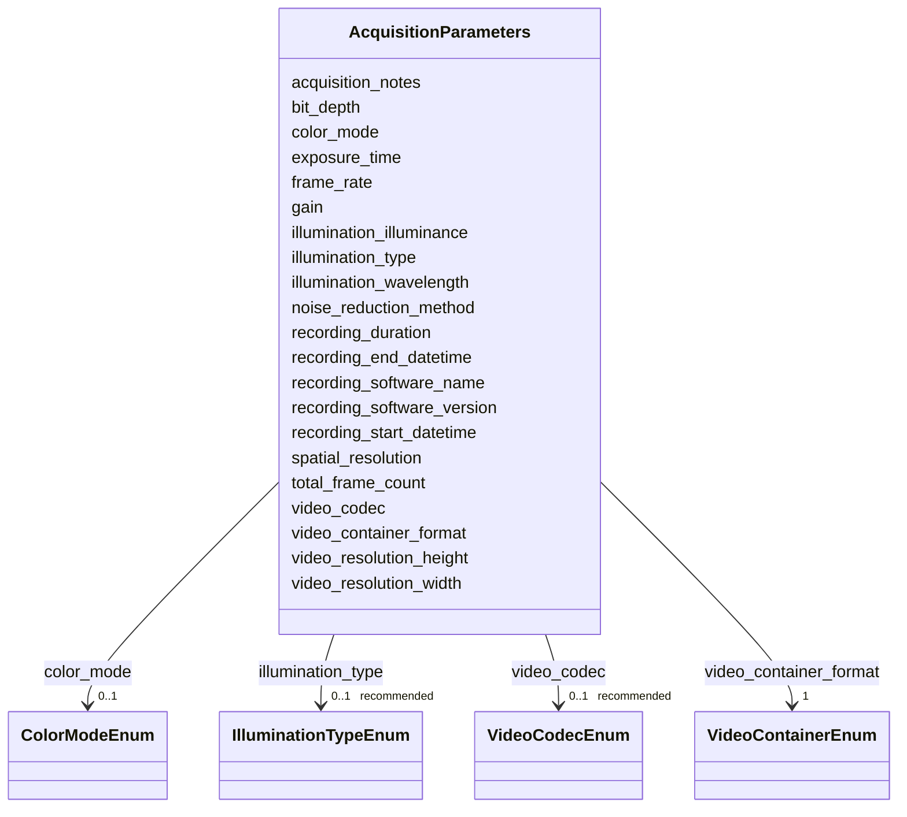

---
search:
  boost: 10.0
---

# Class: AcquisitionParameters 


_Video acquisition and recording parameters._


<div data-search-exclude markdown="1">


URI: [BeStMeta:AcquisitionParameters](https://w3id.org/BeStMeta/AcquisitionParameters)





<!-- no inheritance hierarchy -->

## Slots

| Name | Cardinality and Range | Description | Inheritance |
| ---  | --- | --- | --- |
| [recording_duration](recording_duration.md) | 1 <br/> [Duration](Duration.md) | Total duration of the video recording in ISO 8601 duration format | direct |
| [recording_software_name](recording_software_name.md) | 1 <br/> [String](String.md) | Name of the software used to record the video | direct |
| [recording_software_version](recording_software_version.md) | 1 <br/> [String](String.md) | Version string of the recording software | direct |
| [frame_rate](frame_rate.md) | 1 <br/> [Float](Float.md) | Number of frames captured per second (fps) during video recording | direct |
| [video_resolution_width](video_resolution_width.md) | 1 <br/> [Integer](Integer.md) | Horizontal pixel count of the recorded video | direct |
| [video_resolution_height](video_resolution_height.md) | 1 <br/> [Integer](Integer.md) | Vertical pixel count of the recorded video | direct |
| [video_container_format](video_container_format.md) | 1 <br/> [VideoContainerEnum](VideoContainerEnum.md) | File container format of the recorded video | direct |
| [recording_start_datetime](recording_start_datetime.md) | 0..1 _recommended_ <br/> [Datetime](Datetime.md) | Date and time at which acquisition of the video recording began | direct |
| [recording_end_datetime](recording_end_datetime.md) | 0..1 _recommended_ <br/> [Datetime](Datetime.md) | Date and time at which acquisition of the video recording ended | direct |
| [illumination_type](illumination_type.md) | 0..1 _recommended_ <br/> [IlluminationTypeEnum](IlluminationTypeEnum.md) | Type of illumination used during recording | direct |
| [spatial_resolution](spatial_resolution.md) | 0..1 _recommended_ <br/> [Float](Float.md) | Physical size represented by one pixel at the observation plane | direct |
| [video_codec](video_codec.md) | 0..1 _recommended_ <br/> [VideoCodecEnum](VideoCodecEnum.md) | Video compression codec used for recording | direct |
| [exposure_time](exposure_time.md) | 0..1 _recommended_ <br/> [Float](Float.md) | Camera sensor exposure time per frame | direct |
| [noise_reduction_method](noise_reduction_method.md) | 0..1 _recommended_ <br/> [String](String.md) | Method or algorithm used to reduce image noise during acquisition or immediat... | direct |
| [bit_depth](bit_depth.md) | 0..1 <br/> [Integer](Integer.md) | Bit depth per pixel channel of the recorded video | direct |
| [illumination_wavelength](illumination_wavelength.md) | 0..1 <br/> [Float](Float.md) | Peak wavelength of the illumination source in nanometres | direct |
| [illumination_illuminance](illumination_illuminance.md) | 0..1 <br/> [Float](Float.md) | Illuminance at the recording arena or observation surface | direct |
| [total_frame_count](total_frame_count.md) | 0..1 <br/> [Integer](Integer.md) | Total number of frames in the video | direct |
| [color_mode](color_mode.md) | 0..1 <br/> [ColorModeEnum](ColorModeEnum.md) | Color mode of the recorded video | direct |
| [gain](gain.md) | 0..1 <br/> [String](String.md) | Camera gain setting at the time of recording | direct |
| [acquisition_notes](acquisition_notes.md) | 0..1 <br/> [String](String.md) | Free-text notes on acquisition settings | direct |


## Usages

| used by | used in | type | used |
| ---  | --- | --- | --- |
| [VTADataset](VTADataset.md) | [acquisition_parameters](acquisition_parameters.md) | range | [AcquisitionParameters](AcquisitionParameters.md) |


## Rules


### 

| Rule Applied | Preconditions | Postconditions | Elseconditions |
|--------------|---------------|----------------|----------------|
| slot_conditions |```{'video_codec': {'any_of': [{'equals_string': 'ffv1'}, {'equals_string': 'raw'}]}}``` |```{'bit_depth': {'recommended': True}}``` | |


## Identifier and Mapping Information


### Schema Source


* from schema: https://w3id.org/bestmeta/schema


## Mappings

| Mapping Type | Mapped Value |
| ---  | ---  |
| self | BeStMeta:AcquisitionParameters |
| native | BeStMeta:AcquisitionParameters |


## LinkML Source

<!-- TODO: investigate https://stackoverflow.com/questions/37606292/how-to-create-tabbed-code-blocks-in-mkdocs-or-sphinx -->

### Direct

<details>
```yaml
name: AcquisitionParameters
description: Video acquisition and recording parameters.
from_schema: https://w3id.org/bestmeta/schema
slots:
- recording_duration
- recording_software_name
- recording_software_version
- frame_rate
- video_resolution_width
- video_resolution_height
- video_container_format
- recording_start_datetime
- recording_end_datetime
- illumination_type
- spatial_resolution
- video_codec
- exposure_time
- noise_reduction_method
- bit_depth
- illumination_wavelength
- illumination_illuminance
- total_frame_count
- color_mode
- gain
- acquisition_notes
rules:
- preconditions:
    slot_conditions:
      video_codec:
        name: video_codec
        any_of:
        - equals_string: ffv1
        - equals_string: raw
  postconditions:
    slot_conditions:
      bit_depth:
        name: bit_depth
        recommended: true
  description: Bit depth should be reported when it is available for lossless or uncompressed
    video.

```
</details>

### Induced

<details>
```yaml
name: AcquisitionParameters
description: Video acquisition and recording parameters.
from_schema: https://w3id.org/bestmeta/schema
attributes:
  recording_duration:
    name: recording_duration
    description: Total duration of the video recording in ISO 8601 duration format.
    notes:
    - Use ISO 8601 duration format.
    examples:
    - value: PT30M
      description: 30 minutes
    - value: PT1H15M30S
      description: 1 hour, 15 minutes, 30 seconds
    - value: PT45S
      description: 45 seconds
    from_schema: https://w3id.org/bestmeta/schema
    exact_mappings:
    - AFR:0000951
    close_mappings:
    - schema:duration
    rank: 1000
    owner: AcquisitionParameters
    domain_of:
    - AcquisitionParameters
    range: duration
    required: true
  recording_software_name:
    name: recording_software_name
    description: Name of the software used to record the video.
    from_schema: https://w3id.org/bestmeta/schema
    exact_mappings:
    - AFR:0002802
    rank: 1000
    owner: AcquisitionParameters
    domain_of:
    - AcquisitionParameters
    range: string
    required: true
  recording_software_version:
    name: recording_software_version
    description: Version string of the recording software.
    from_schema: https://w3id.org/bestmeta/schema
    exact_mappings:
    - AFR:0001700
    rank: 1000
    owner: AcquisitionParameters
    domain_of:
    - AcquisitionParameters
    range: string
    required: true
  frame_rate:
    name: frame_rate
    description: Number of frames captured per second (fps) during video recording.
    from_schema: https://w3id.org/bestmeta/schema
    exact_mappings:
    - ebucore:frameRate
    close_mappings:
    - ma:frameRate
    rank: 1000
    owner: AcquisitionParameters
    domain_of:
    - AcquisitionParameters
    range: float
    required: true
    unit:
      ucum_code: Hz
  video_resolution_width:
    name: video_resolution_width
    description: Horizontal pixel count of the recorded video.
    from_schema: https://w3id.org/bestmeta/schema
    close_mappings:
    - ebucore:width
    rank: 1000
    owner: AcquisitionParameters
    domain_of:
    - AcquisitionParameters
    range: integer
    required: true
    unit:
      ucum_code: px
  video_resolution_height:
    name: video_resolution_height
    description: Vertical pixel count of the recorded video.
    from_schema: https://w3id.org/bestmeta/schema
    close_mappings:
    - ebucore:height
    rank: 1000
    owner: AcquisitionParameters
    domain_of:
    - AcquisitionParameters
    range: integer
    required: true
    unit:
      ucum_code: px
  video_container_format:
    name: video_container_format
    description: File container format of the recorded video.
    notes:
    - Report the container format, not the codec.
    - Codec is captured separately in video_codec.
    from_schema: https://w3id.org/bestmeta/schema
    exact_mappings:
    - ebucore:hasContainerFormat
    rank: 1000
    owner: AcquisitionParameters
    domain_of:
    - AcquisitionParameters
    range: VideoContainerEnum
    required: true
  recording_start_datetime:
    name: recording_start_datetime
    description: Date and time at which acquisition of the video recording began.
    from_schema: https://w3id.org/bestmeta/schema
    rank: 1000
    owner: AcquisitionParameters
    domain_of:
    - AcquisitionParameters
    range: datetime
    required: false
    recommended: true
  recording_end_datetime:
    name: recording_end_datetime
    description: Date and time at which acquisition of the video recording ended.
    from_schema: https://w3id.org/bestmeta/schema
    rank: 1000
    owner: AcquisitionParameters
    domain_of:
    - AcquisitionParameters
    range: datetime
    required: false
    recommended: true
  illumination_type:
    name: illumination_type
    description: Type of illumination used during recording.
    from_schema: https://w3id.org/bestmeta/schema
    exact_mappings:
    - MIxS:0000769
    rank: 1000
    owner: AcquisitionParameters
    domain_of:
    - AcquisitionParameters
    range: IlluminationTypeEnum
    required: false
    recommended: true
  spatial_resolution:
    name: spatial_resolution
    description: Physical size represented by one pixel at the observation plane.
    from_schema: https://w3id.org/bestmeta/schema
    close_mappings:
    - dicom:SpatialResolution
    rank: 1000
    owner: AcquisitionParameters
    domain_of:
    - AcquisitionParameters
    range: float
    required: false
    recommended: true
    unit:
      ucum_code: mm/px
  video_codec:
    name: video_codec
    description: Video compression codec used for recording.
    notes:
    - Report the codec, not the container format.
    - Container format is captured separately in video_container_format.
    - mp4 is a container, not a codec — most mp4 files use H264 or H265 as codec.
    from_schema: https://w3id.org/bestmeta/schema
    exact_mappings:
    - ebucore:codecName
    rank: 1000
    owner: AcquisitionParameters
    domain_of:
    - AcquisitionParameters
    range: VideoCodecEnum
    required: false
    recommended: true
  exposure_time:
    name: exposure_time
    description: Camera sensor exposure time per frame.
    from_schema: https://w3id.org/bestmeta/schema
    exact_mappings:
    - REPRODUCEME:ExposureTime
    rank: 1000
    owner: AcquisitionParameters
    domain_of:
    - AcquisitionParameters
    range: float
    required: false
    recommended: true
    unit:
      ucum_code: ms
  noise_reduction_method:
    name: noise_reduction_method
    description: Method or algorithm used to reduce image noise during acquisition
      or immediately after recording.
    from_schema: https://w3id.org/bestmeta/schema
    rank: 1000
    owner: AcquisitionParameters
    domain_of:
    - AcquisitionParameters
    range: string
    required: false
    recommended: true
  bit_depth:
    name: bit_depth
    description: Bit depth per pixel channel of the recorded video.
    notes:
    - Common values are 8-bit and 16-bit.
    examples:
    - value: '8'
    - value: '16'
    from_schema: https://w3id.org/bestmeta/schema
    exact_mappings:
    - ebucore:bitDepth
    rank: 1000
    owner: AcquisitionParameters
    domain_of:
    - AcquisitionParameters
    range: integer
    required: false
  illumination_wavelength:
    name: illumination_wavelength
    description: Peak wavelength of the illumination source in nanometres. Use for
      non-white-light sources such as infrared or UV.
    from_schema: https://w3id.org/bestmeta/schema
    exact_mappings:
    - AFR:0001159
    close_mappings:
    - PATO:0001242
    rank: 1000
    owner: AcquisitionParameters
    domain_of:
    - AcquisitionParameters
    range: float
    required: false
    unit:
      ucum_code: nm
  illumination_illuminance:
    name: illumination_illuminance
    description: Illuminance at the recording arena or observation surface.
    examples:
    - value: '0'
      description: Dark condition
    - value: '100'
      description: Dim illumination
    - value: '1000'
      description: Bright laboratory illumination
    from_schema: https://w3id.org/bestmeta/schema
    exact_mappings:
    - OM:Illuminance
    rank: 1000
    owner: AcquisitionParameters
    domain_of:
    - AcquisitionParameters
    range: float
    required: false
    unit:
      ucum_code: lx
  total_frame_count:
    name: total_frame_count
    description: Total number of frames in the video. Can be derived from frame_rate
      × recording_duration if not explicitly stated.
    notes:
    - Prefer direct reporting when available.
    - If absent, it may be computed from frame rate and actual trial duration.
    from_schema: https://w3id.org/bestmeta/schema
    exact_mappings:
    - dicom:NumberOfFrames
    rank: 1000
    owner: AcquisitionParameters
    domain_of:
    - AcquisitionParameters
    range: integer
    required: false
  color_mode:
    name: color_mode
    description: Color mode of the recorded video. Affects tracking algorithm behavior
      and file size.
    from_schema: https://w3id.org/bestmeta/schema
    rank: 1000
    owner: AcquisitionParameters
    domain_of:
    - AcquisitionParameters
    range: ColorModeEnum
    required: false
  gain:
    name: gain
    description: Camera gain setting at the time of recording.
    from_schema: https://w3id.org/bestmeta/schema
    exact_mappings:
    - AFQ:0000201
    rank: 1000
    owner: AcquisitionParameters
    domain_of:
    - AcquisitionParameters
    range: string
    required: false
  acquisition_notes:
    name: acquisition_notes
    description: Free-text notes on acquisition settings
    from_schema: https://w3id.org/bestmeta/schema
    rank: 1000
    owner: AcquisitionParameters
    domain_of:
    - AcquisitionParameters
    range: string
    required: false
rules:
- preconditions:
    slot_conditions:
      video_codec:
        name: video_codec
        any_of:
        - equals_string: ffv1
        - equals_string: raw
  postconditions:
    slot_conditions:
      bit_depth:
        name: bit_depth
        recommended: true
  description: Bit depth should be reported when it is available for lossless or uncompressed
    video.

```
</details></div>