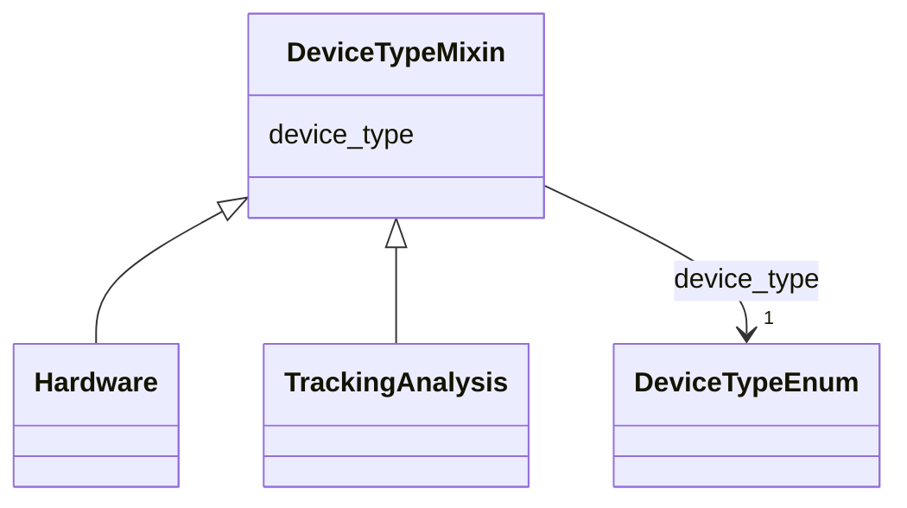

---
search:
  boost: 10.0
---

# Class: DeviceTypeMixin 


_Reusable slot bundle providing device_type, allowing multiple classes (e.g. Hardware, TrackingAnalysis) to independently branch their validation rules based on the type of imaging system used, without requiring cross-class rule evaluation._


<div data-search-exclude markdown="1">


URI: [BeStMeta:DeviceTypeMixin](https://w3id.org/BeStMeta/DeviceTypeMixin)





<!-- no inheritance hierarchy -->

## Class Properties

| Property | Value |
| --- | --- |
| Mixin | Yes |


## Slots

| Name | Cardinality and Range | Description | Inheritance |
| ---  | --- | --- | --- |
| [device_type](device_type.md) | 1 <br/> [DeviceTypeEnum](DeviceTypeEnum.md) | Indicates the category of imaging system used; determines which additional ha... | direct |


## Mixin Usage

| mixed into | description |
| --- | --- |
| [Hardware](Hardware.md) | Camera systems, optical configuration, and physical recording infrastructure ... |
| [TrackingAnalysis](TrackingAnalysis.md) | Tracking software identity and version, algorithm details, post-tracking comp... |


## Identifier and Mapping Information


### Schema Source


* from schema: https://w3id.org/bestmeta/schema


## Mappings

| Mapping Type | Mapped Value |
| ---  | ---  |
| self | BeStMeta:DeviceTypeMixin |
| native | BeStMeta:DeviceTypeMixin |


## LinkML Source

<!-- TODO: investigate https://stackoverflow.com/questions/37606292/how-to-create-tabbed-code-blocks-in-mkdocs-or-sphinx -->

### Direct

<details>
```yaml
name: DeviceTypeMixin
description: Reusable slot bundle providing device_type, allowing multiple classes
  (e.g. Hardware, TrackingAnalysis) to independently branch their validation rules
  based on the type of imaging system used, without requiring cross-class rule evaluation.
from_schema: https://w3id.org/bestmeta/schema
mixin: true
slots:
- device_type

```
</details>

### Induced

<details>
```yaml
name: DeviceTypeMixin
description: Reusable slot bundle providing device_type, allowing multiple classes
  (e.g. Hardware, TrackingAnalysis) to independently branch their validation rules
  based on the type of imaging system used, without requiring cross-class rule evaluation.
from_schema: https://w3id.org/bestmeta/schema
mixin: true
attributes:
  device_type:
    name: device_type
    description: Indicates the category of imaging system used; determines which additional
      hardware or tracking fields are required or recommended.
    from_schema: https://w3id.org/bestmeta/schema
    rank: 1000
    owner: DeviceTypeMixin
    domain_of:
    - DeviceTypeMixin
    range: DeviceTypeEnum
    required: true

```
</details></div>