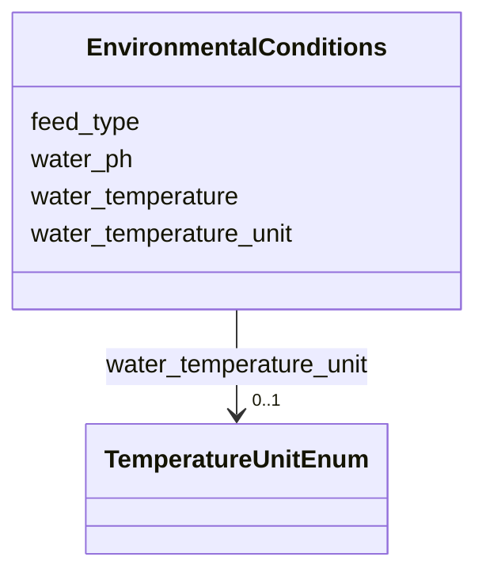

---
search:
  boost: 10.0
---

# Class: EnvironmentalConditions 


_Environmental conditions and husbandry parameters for the experiments._


<div data-search-exclude markdown="1">


URI: [BeStMeta:EnvironmentalConditions](https://w3id.org/BeStMeta/EnvironmentalConditions)





<!-- no inheritance hierarchy -->

## Slots

| Name | Cardinality and Range | Description | Inheritance |
| ---  | --- | --- | --- |
| [feed_type](feed_type.md) | 0..1 <br/> [String](String.md) | Type of feed provided to the subject(s) | direct |
| [water_ph](water_ph.md) | 0..1 <br/> [Float](Float.md) | pH of the water in housing/experimnetal conditions | direct |
| [water_temperature](water_temperature.md) | 0..1 <br/> [Float](Float.md) | The temperature of the water during the experiment | direct |
| [water_temperature_unit](water_temperature_unit.md) | 0..1 <br/> [TemperatureUnitEnum](TemperatureUnitEnum.md) | The unit of the water temperature | direct |


## Usages

| used by | used in | type | used |
| ---  | --- | --- | --- |
| [Experiment](Experiment.md) | [environmental_conditions](environmental_conditions.md) | range | [EnvironmentalConditions](EnvironmentalConditions.md) |


## Rules


### 

| Rule Applied | Preconditions | Postconditions | Elseconditions |
|--------------|---------------|----------------|----------------|
| slot_conditions |```{'water_temperature': {'required': True}}``` |```{'water_temperature_unit': {'required': True}}``` | |


## Identifier and Mapping Information


### Schema Source


* from schema: https://w3id.org/bestmeta/schema


## Mappings

| Mapping Type | Mapped Value |
| ---  | ---  |
| self | BeStMeta:EnvironmentalConditions |
| native | BeStMeta:EnvironmentalConditions |


## LinkML Source

<!-- TODO: investigate https://stackoverflow.com/questions/37606292/how-to-create-tabbed-code-blocks-in-mkdocs-or-sphinx -->

### Direct

<details>
```yaml
name: EnvironmentalConditions
description: Environmental conditions and husbandry parameters for the experiments.
from_schema: https://w3id.org/bestmeta/schema
slots:
- feed_type
- water_ph
- water_temperature
- water_temperature_unit
rules:
- preconditions:
    slot_conditions:
      water_temperature:
        name: water_temperature
        required: true
  postconditions:
    slot_conditions:
      water_temperature_unit:
        name: water_temperature_unit
        required: true
  description: water temperature requires water temperature unit

```
</details>

### Induced

<details>
```yaml
name: EnvironmentalConditions
description: Environmental conditions and husbandry parameters for the experiments.
from_schema: https://w3id.org/bestmeta/schema
attributes:
  feed_type:
    name: feed_type
    description: Type of feed provided to the subject(s).
    from_schema: https://w3id.org/bestmeta/schema
    rank: 1000
    owner: EnvironmentalConditions
    domain_of:
    - EnvironmentalConditions
    range: string
  water_ph:
    name: water_ph
    description: pH of the water in housing/experimnetal conditions
    from_schema: https://w3id.org/bestmeta/schema
    rank: 1000
    owner: EnvironmentalConditions
    domain_of:
    - EnvironmentalConditions
    range: float
  water_temperature:
    name: water_temperature
    description: The temperature of the water during the experiment
    from_schema: https://w3id.org/bestmeta/schema
    rank: 1000
    owner: EnvironmentalConditions
    domain_of:
    - EnvironmentalConditions
    range: float
  water_temperature_unit:
    name: water_temperature_unit
    description: The unit of the water temperature.
    from_schema: https://w3id.org/bestmeta/schema
    rank: 1000
    owner: EnvironmentalConditions
    domain_of:
    - EnvironmentalConditions
    range: TemperatureUnitEnum
rules:
- preconditions:
    slot_conditions:
      water_temperature:
        name: water_temperature
        required: true
  postconditions:
    slot_conditions:
      water_temperature_unit:
        name: water_temperature_unit
        required: true
  description: water temperature requires water temperature unit

```
</details></div>