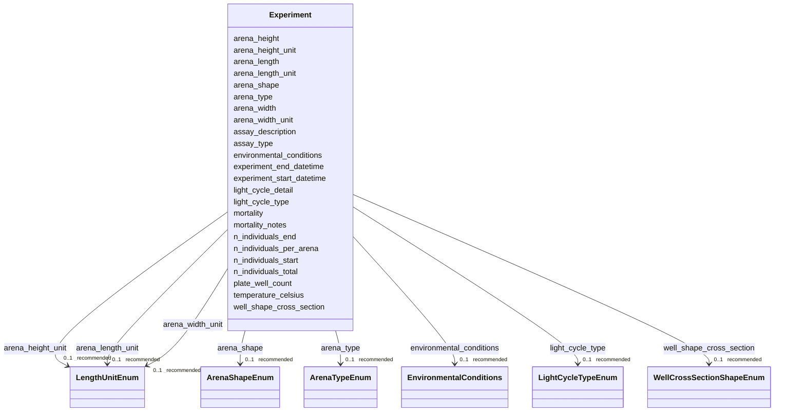

---
search:
  boost: 10.0
---

# Class: Experiment 


_Defines experimental context in which the subjects were studied. Covers environmental parameters like study counts, arena geometry, temperature, multi well plate details etc._


<div data-search-exclude markdown="1">


URI: [BeStMeta:Experiment](https://w3id.org/BeStMeta/Experiment)





<!-- no inheritance hierarchy -->

## Slots

| Name | Cardinality and Range | Description | Inheritance |
| ---  | --- | --- | --- |
| [n_individuals_total](n_individuals_total.md) | 1 <br/> [Integer](Integer.md) | Total number of individuals used in the experiment | direct |
| [n_individuals_per_arena](n_individuals_per_arena.md) | 1 <br/> [Integer](Integer.md) | Number of individuals tested simultaneously in the arena | direct |
| [assay_type](assay_type.md) | 1 <br/> [String](String.md) | Name of the behavioral assay paradigm or test paradigm | direct |
| [experiment_start_datetime](experiment_start_datetime.md) | 0..1 _recommended_ <br/> [Datetime](Datetime.md) | Date and time at which the experiment began | direct |
| [experiment_end_datetime](experiment_end_datetime.md) | 0..1 _recommended_ <br/> [Datetime](Datetime.md) | Date and time at which the experiment ended | direct |
| [arena_shape](arena_shape.md) | 0..1 _recommended_ <br/> [ArenaShapeEnum](ArenaShapeEnum.md) | Geometric shape of the test arena | direct |
| [arena_type](arena_type.md) | 0..1 _recommended_ <br/> [ArenaTypeEnum](ArenaTypeEnum.md) | Type of the test arena, e | direct |
| [arena_length](arena_length.md) | 0..1 _recommended_ <br/> [Float](Float.md) | Length of the arena along one axis | direct |
| [arena_length_unit](arena_length_unit.md) | 0..1 _recommended_ <br/> [LengthUnitEnum](LengthUnitEnum.md) | Unit of measurement for arena_length | direct |
| [arena_width](arena_width.md) | 0..1 _recommended_ <br/> [Float](Float.md) | Width of the arena along one axis | direct |
| [arena_width_unit](arena_width_unit.md) | 0..1 _recommended_ <br/> [LengthUnitEnum](LengthUnitEnum.md) | Unit of measurement for arena_width | direct |
| [arena_height](arena_height.md) | 0..1 _recommended_ <br/> [Float](Float.md) | Height of the arena, when applicable | direct |
| [arena_height_unit](arena_height_unit.md) | 0..1 _recommended_ <br/> [LengthUnitEnum](LengthUnitEnum.md) | Unit of measurement for arena_height | direct |
| [plate_well_count](plate_well_count.md) | 0..1 _recommended_ <br/> [Integer](Integer.md) | Number of wells in the multiwell plate | direct |
| [well_shape_cross_section](well_shape_cross_section.md) | 0..1 _recommended_ <br/> [WellCrossSectionShapeEnum](WellCrossSectionShapeEnum.md) | Geometric cross section shape of the wells of a multiwell plate | direct |
| [temperature_celsius](temperature_celsius.md) | 0..1 _recommended_ <br/> [Float](Float.md) | Water or ambient temperature during the recording in degrees Celsius | direct |
| [light_cycle_type](light_cycle_type.md) | 0..1 _recommended_ <br/> [LightCycleTypeEnum](LightCycleTypeEnum.md) | Standardized category of the light-dark cycle | direct |
| [light_cycle_detail](light_cycle_detail.md) | 0..1 _recommended_ <br/> [String](String.md) | Free-text description of the light-dark cycle | direct |
| [mortality](mortality.md) | 0..1 _recommended_ <br/> [Boolean](Boolean.md) | Indicates whether a subject died during the course of the experiment | direct |
| [n_individuals_start](n_individuals_start.md) | 0..1 <br/> [Integer](Integer.md) | Number of individuals at the start of the experiment/trial | direct |
| [n_individuals_end](n_individuals_end.md) | 0..1 <br/> [Integer](Integer.md) | Number of individuals at the end of the experiment/trial | direct |
| [environmental_conditions](environmental_conditions.md) | 0..1 _recommended_ <br/> [EnvironmentalConditions](EnvironmentalConditions.md) | Environmental conditions during the experiment, including water chemistry,  f... | direct |
| [assay_description](assay_description.md) | 0..1 <br/> [String](String.md) | Free-text description of the assay protocol | direct |
| [mortality_notes](mortality_notes.md) | 0..1 <br/> [String](String.md) | Free-test notes on any deaths that occured during the trial | direct |


## Usages

| used by | used in | type | used |
| ---  | --- | --- | --- |
| [ExperimentalConditions](ExperimentalConditions.md) | [experiment](experiment.md) | range | [Experiment](Experiment.md) |


## Rules


### 

| Rule Applied | Preconditions | Postconditions | Elseconditions |
|--------------|---------------|----------------|----------------|
| slot_conditions |```{'arena_length': {'value_presence': 'PRESENT'}}``` |```{'arena_length_unit': {'required': True}}``` | |


### 

| Rule Applied | Preconditions | Postconditions | Elseconditions |
|--------------|---------------|----------------|----------------|
| slot_conditions |```{'arena_width': {'value_presence': 'PRESENT'}}``` |```{'arena_width_unit': {'required': True}}``` | |


### 

| Rule Applied | Preconditions | Postconditions | Elseconditions |
|--------------|---------------|----------------|----------------|
| slot_conditions |```{'arena_height': {'value_presence': 'PRESENT'}}``` |```{'arena_height_unit': {'required': True}}``` | |


### 

| Rule Applied | Preconditions | Postconditions | Elseconditions |
|--------------|---------------|----------------|----------------|
| slot_conditions |```{'light_cycle_type': {'equals_string': 'cyclic_ld'}}``` |```{'light_cycle_detail': {'required': True}}``` | |


### 

| Rule Applied | Preconditions | Postconditions | Elseconditions |
|--------------|---------------|----------------|----------------|
| slot_conditions |```{'mortality': {'equals_expression': 'true'}}``` |```{'n_individuals_start': {'required': True}, 'n_individuals_end': {'required': True}}``` | |


## Identifier and Mapping Information


### Schema Source


* from schema: https://w3id.org/bestmeta/schema


## Mappings

| Mapping Type | Mapped Value |
| ---  | ---  |
| self | BeStMeta:Experiment |
| native | BeStMeta:Experiment |


## LinkML Source

<!-- TODO: investigate https://stackoverflow.com/questions/37606292/how-to-create-tabbed-code-blocks-in-mkdocs-or-sphinx -->

### Direct

<details>
```yaml
name: Experiment
description: Defines experimental context in which the subjects were studied. Covers
  environmental parameters like study counts, arena geometry, temperature, multi well
  plate details etc.
from_schema: https://w3id.org/bestmeta/schema
slots:
- n_individuals_total
- n_individuals_per_arena
- assay_type
- experiment_start_datetime
- experiment_end_datetime
- arena_shape
- arena_type
- arena_length
- arena_length_unit
- arena_width
- arena_width_unit
- arena_height
- arena_height_unit
- plate_well_count
- well_shape_cross_section
- temperature_celsius
- light_cycle_type
- light_cycle_detail
- mortality
- n_individuals_start
- n_individuals_end
- environmental_conditions
- assay_description
- mortality_notes
rules:
- preconditions:
    slot_conditions:
      arena_length:
        name: arena_length
        value_presence: PRESENT
  postconditions:
    slot_conditions:
      arena_length_unit:
        name: arena_length_unit
        required: true
  description: arena_length requires arena_length_unit
- preconditions:
    slot_conditions:
      arena_width:
        name: arena_width
        value_presence: PRESENT
  postconditions:
    slot_conditions:
      arena_width_unit:
        name: arena_width_unit
        required: true
  description: arena_width requires arena_width_unit
- preconditions:
    slot_conditions:
      arena_height:
        name: arena_height
        value_presence: PRESENT
  postconditions:
    slot_conditions:
      arena_height_unit:
        name: arena_height_unit
        required: true
  description: arena_height requires arena_height_unit
- preconditions:
    slot_conditions:
      light_cycle_type:
        name: light_cycle_type
        equals_string: cyclic_ld
  postconditions:
    slot_conditions:
      light_cycle_detail:
        name: light_cycle_detail
        required: true
  description: If light_cycle_type is cyclic_ld, light_cycle_detail should be provided.
- preconditions:
    slot_conditions:
      mortality:
        name: mortality
        equals_expression: 'true'
  postconditions:
    slot_conditions:
      n_individuals_start:
        name: n_individuals_start
        required: true
      n_individuals_end:
        name: n_individuals_end
        required: true
  description: when mortality is true, counts of individuals at the start and end
    are required

```
</details>

### Induced

<details>
```yaml
name: Experiment
description: Defines experimental context in which the subjects were studied. Covers
  environmental parameters like study counts, arena geometry, temperature, multi well
  plate details etc.
from_schema: https://w3id.org/bestmeta/schema
attributes:
  n_individuals_total:
    name: n_individuals_total
    description: Total number of individuals used in the experiment.
    from_schema: https://w3id.org/bestmeta/schema
    rank: 1000
    owner: Experiment
    domain_of:
    - Experiment
    range: integer
    required: true
  n_individuals_per_arena:
    name: n_individuals_per_arena
    description: Number of individuals tested simultaneously in the arena.
    from_schema: https://w3id.org/bestmeta/schema
    rank: 1000
    owner: Experiment
    domain_of:
    - Experiment
    range: integer
    required: true
    minimum_value: 1
  assay_type:
    name: assay_type
    description: Name of the behavioral assay paradigm or test paradigm.
    examples:
    - value: open field test
    - value: light-dark transition
    - value: elevated plus maze
    - value: locomotor activity assay
    - value: chemobehavioral assay
    from_schema: https://w3id.org/bestmeta/schema
    broad_mappings:
    - OBI:0000070
    rank: 1000
    owner: Experiment
    domain_of:
    - Experiment
    range: string
    required: true
  experiment_start_datetime:
    name: experiment_start_datetime
    description: Date and time at which the experiment began.
    from_schema: https://w3id.org/bestmeta/schema
    rank: 1000
    owner: Experiment
    domain_of:
    - Experiment
    range: datetime
    required: false
    recommended: true
  experiment_end_datetime:
    name: experiment_end_datetime
    description: Date and time at which the experiment ended.
    from_schema: https://w3id.org/bestmeta/schema
    rank: 1000
    owner: Experiment
    domain_of:
    - Experiment
    range: datetime
    required: false
    recommended: true
  arena_shape:
    name: arena_shape
    description: Geometric shape of the test arena.
    from_schema: https://w3id.org/bestmeta/schema
    broad_mappings:
    - OBI:0000968
    rank: 1000
    owner: Experiment
    domain_of:
    - Experiment
    range: ArenaShapeEnum
    required: false
    recommended: true
  arena_type:
    name: arena_type
    description: Type of the test arena, e.g., open field, multiwell plate or elevated
      plus maze.
    from_schema: https://w3id.org/bestmeta/schema
    rank: 1000
    owner: Experiment
    domain_of:
    - Experiment
    range: ArenaTypeEnum
    required: false
    recommended: true
  arena_length:
    name: arena_length
    description: Length of the arena along one axis.
    from_schema: https://w3id.org/bestmeta/schema
    rank: 1000
    owner: Experiment
    domain_of:
    - Experiment
    range: float
    required: false
    recommended: true
  arena_length_unit:
    name: arena_length_unit
    description: Unit of measurement for arena_length.
    from_schema: https://w3id.org/bestmeta/schema
    rank: 1000
    owner: Experiment
    domain_of:
    - Experiment
    range: LengthUnitEnum
    required: false
    recommended: true
  arena_width:
    name: arena_width
    description: Width of the arena along one axis.
    from_schema: https://w3id.org/bestmeta/schema
    rank: 1000
    owner: Experiment
    domain_of:
    - Experiment
    range: float
    required: false
    recommended: true
  arena_width_unit:
    name: arena_width_unit
    description: Unit of measurement for arena_width.
    from_schema: https://w3id.org/bestmeta/schema
    rank: 1000
    owner: Experiment
    domain_of:
    - Experiment
    range: LengthUnitEnum
    required: false
    recommended: true
  arena_height:
    name: arena_height
    description: Height of the arena, when applicable.
    from_schema: https://w3id.org/bestmeta/schema
    rank: 1000
    owner: Experiment
    domain_of:
    - Experiment
    range: float
    required: false
    recommended: true
  arena_height_unit:
    name: arena_height_unit
    description: Unit of measurement for arena_height.
    from_schema: https://w3id.org/bestmeta/schema
    rank: 1000
    owner: Experiment
    domain_of:
    - Experiment
    range: LengthUnitEnum
    required: false
    recommended: true
  plate_well_count:
    name: plate_well_count
    description: Number of wells in the multiwell plate.
    examples:
    - value: '24'
    - value: '96'
    from_schema: https://w3id.org/bestmeta/schema
    exact_mappings:
    - AFR:0002231
    rank: 1000
    owner: Experiment
    domain_of:
    - Experiment
    range: integer
    required: false
    recommended: true
    minimum_value: 1
  well_shape_cross_section:
    name: well_shape_cross_section
    description: Geometric cross section shape of the wells of a multiwell plate.
    from_schema: https://w3id.org/bestmeta/schema
    rank: 1000
    owner: Experiment
    domain_of:
    - Experiment
    range: WellCrossSectionShapeEnum
    required: false
    recommended: true
  temperature_celsius:
    name: temperature_celsius
    description: Water or ambient temperature during the recording in degrees Celsius
    from_schema: https://w3id.org/bestmeta/schema
    rank: 1000
    owner: Experiment
    domain_of:
    - Experiment
    range: float
    required: false
    recommended: true
    unit:
      ucum_code: Cel
  light_cycle_type:
    name: light_cycle_type
    description: Standardized category of the light-dark cycle.
    from_schema: https://w3id.org/bestmeta/schema
    rank: 1000
    owner: Experiment
    domain_of:
    - Experiment
    range: LightCycleTypeEnum
    required: false
    recommended: true
  light_cycle_detail:
    name: light_cycle_detail
    description: Free-text description of the light-dark cycle.
    from_schema: https://w3id.org/bestmeta/schema
    exact_mappings:
    - MESH:D017440
    rank: 1000
    owner: Experiment
    domain_of:
    - Experiment
    range: string
    required: false
    recommended: true
  mortality:
    name: mortality
    description: Indicates whether a subject died during the course of the experiment.
    from_schema: https://w3id.org/bestmeta/schema
    rank: 1000
    owner: Experiment
    domain_of:
    - Experiment
    range: boolean
    required: false
    recommended: true
  n_individuals_start:
    name: n_individuals_start
    description: Number of individuals at the start of the experiment/trial.
    from_schema: https://w3id.org/bestmeta/schema
    rank: 1000
    owner: Experiment
    domain_of:
    - Experiment
    range: integer
  n_individuals_end:
    name: n_individuals_end
    description: Number of individuals at the end of the experiment/trial.
    from_schema: https://w3id.org/bestmeta/schema
    rank: 1000
    owner: Experiment
    domain_of:
    - Experiment
    range: integer
  environmental_conditions:
    name: environmental_conditions
    description: Environmental conditions during the experiment, including water chemistry,  feed,
      and other details.
    from_schema: https://w3id.org/bestmeta/schema
    rank: 1000
    owner: Experiment
    domain_of:
    - Experiment
    range: EnvironmentalConditions
    required: false
    recommended: true
  assay_description:
    name: assay_description
    description: Free-text description of the assay protocol
    from_schema: https://w3id.org/bestmeta/schema
    rank: 1000
    owner: Experiment
    domain_of:
    - Experiment
    range: string
    required: false
  mortality_notes:
    name: mortality_notes
    description: Free-test notes on any deaths that occured during the trial.  This
      can be used to provide additional context about mortality.
    from_schema: https://w3id.org/bestmeta/schema
    rank: 1000
    owner: Experiment
    domain_of:
    - Experiment
    range: string
rules:
- preconditions:
    slot_conditions:
      arena_length:
        name: arena_length
        value_presence: PRESENT
  postconditions:
    slot_conditions:
      arena_length_unit:
        name: arena_length_unit
        required: true
  description: arena_length requires arena_length_unit
- preconditions:
    slot_conditions:
      arena_width:
        name: arena_width
        value_presence: PRESENT
  postconditions:
    slot_conditions:
      arena_width_unit:
        name: arena_width_unit
        required: true
  description: arena_width requires arena_width_unit
- preconditions:
    slot_conditions:
      arena_height:
        name: arena_height
        value_presence: PRESENT
  postconditions:
    slot_conditions:
      arena_height_unit:
        name: arena_height_unit
        required: true
  description: arena_height requires arena_height_unit
- preconditions:
    slot_conditions:
      light_cycle_type:
        name: light_cycle_type
        equals_string: cyclic_ld
  postconditions:
    slot_conditions:
      light_cycle_detail:
        name: light_cycle_detail
        required: true
  description: If light_cycle_type is cyclic_ld, light_cycle_detail should be provided.
- preconditions:
    slot_conditions:
      mortality:
        name: mortality
        equals_expression: 'true'
  postconditions:
    slot_conditions:
      n_individuals_start:
        name: n_individuals_start
        required: true
      n_individuals_end:
        name: n_individuals_end
        required: true
  description: when mortality is true, counts of individuals at the start and end
    are required

```
</details></div>