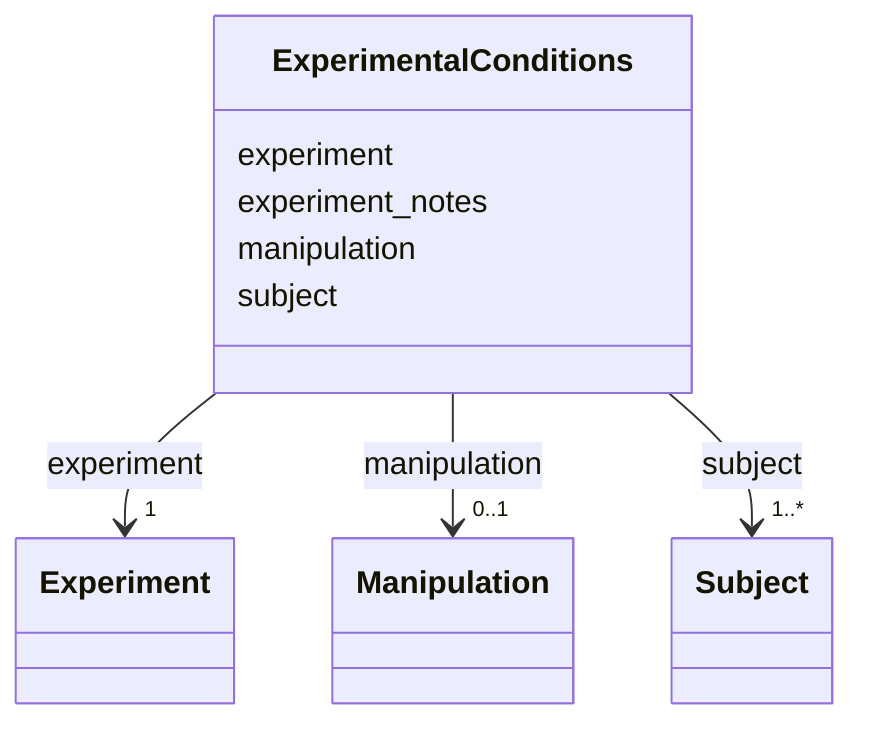

---
search:
  boost: 10.0
---

# Class: ExperimentalConditions 


_Biological and experimental conditions applicable to all trials in the dataset. Covers organism identity, treatment, assay design, and environmental parameters._


<div data-search-exclude markdown="1">


* __NOTE__: this is an abstract class and should not be instantiated directly


URI: [BeStMeta:ExperimentalConditions](https://w3id.org/BeStMeta/ExperimentalConditions)





<!-- no inheritance hierarchy -->

## Slots

| Name | Cardinality and Range | Description | Inheritance |
| ---  | --- | --- | --- |
| [subject](subject.md) | 1..* <br/> [Subject](Subject.md) | Indicates if a single animals or multiple animals are used, it could be 1 for... | direct |
| [experiment](experiment.md) | 1 <br/> [Experiment](Experiment.md) | The experimental setup and environment for this dataset's trials | direct |
| [manipulation](manipulation.md) | 0..1 <br/> [Manipulation](Manipulation.md) | Any intervention applied to the subjects | direct |
| [experiment_notes](experiment_notes.md) | 0..1 <br/> [String](String.md) | Free-text notes on the overall experimental conditions | direct |


## Usages

| used by | used in | type | used |
| ---  | --- | --- | --- |
| [VTADataset](VTADataset.md) | [experimental_conditions](experimental_conditions.md) | range | [ExperimentalConditions](ExperimentalConditions.md) |


## Identifier and Mapping Information


### Schema Source


* from schema: https://w3id.org/bestmeta/schema


## Mappings

| Mapping Type | Mapped Value |
| ---  | ---  |
| self | BeStMeta:ExperimentalConditions |
| native | BeStMeta:ExperimentalConditions |


## LinkML Source

<!-- TODO: investigate https://stackoverflow.com/questions/37606292/how-to-create-tabbed-code-blocks-in-mkdocs-or-sphinx -->

### Direct

<details>
```yaml
name: ExperimentalConditions
description: Biological and experimental conditions applicable to all trials in the
  dataset. Covers organism identity, treatment, assay design, and environmental parameters.
from_schema: https://w3id.org/bestmeta/schema
abstract: true
slots:
- subject
- experiment
- manipulation
- experiment_notes

```
</details>

### Induced

<details>
```yaml
name: ExperimentalConditions
description: Biological and experimental conditions applicable to all trials in the
  dataset. Covers organism identity, treatment, assay design, and environmental parameters.
from_schema: https://w3id.org/bestmeta/schema
abstract: true
attributes:
  subject:
    name: subject
    description: 'Indicates if a single animals or multiple animals are used, it could
      be 1 for single-animal models or well plate studie, >1 for mult--animal rodent
      studies                    '
    from_schema: https://w3id.org/bestmeta/schema
    rank: 1000
    owner: ExperimentalConditions
    domain_of:
    - ExperimentalConditions
    range: Subject
    required: true
    multivalued: true
    inlined: true
  experiment:
    name: experiment
    description: The experimental setup and environment for this dataset's trials.
    from_schema: https://w3id.org/bestmeta/schema
    rank: 1000
    owner: ExperimentalConditions
    domain_of:
    - ExperimentalConditions
    range: Experiment
    required: true
  manipulation:
    name: manipulation
    description: Any intervention applied to the subjects. Omitted when no treatment
      or exposure was used.
    from_schema: https://w3id.org/bestmeta/schema
    rank: 1000
    owner: ExperimentalConditions
    domain_of:
    - ExperimentalConditions
    range: Manipulation
    required: false
  experiment_notes:
    name: experiment_notes
    description: Free-text notes on the overall experimental conditions.
    from_schema: https://w3id.org/bestmeta/schema
    rank: 1000
    owner: ExperimentalConditions
    domain_of:
    - ExperimentalConditions
    range: string
    required: false

```
</details></div>