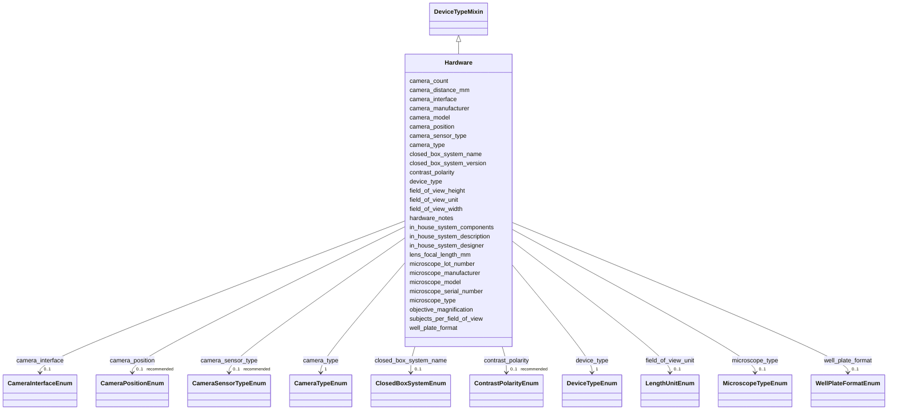

---
search:
  boost: 10.0
---

# Class: Hardware 


_Camera systems, optical configuration, and physical recording infrastructure used in the VTA. Documents instrument identity and optical specifications._


<div data-search-exclude markdown="1">


URI: [BeStMeta:Hardware](https://w3id.org/BeStMeta/Hardware)





## Inheritance
* **Hardware** [ [DeviceTypeMixin](DeviceTypeMixin.md)]


## Slots

| Name | Cardinality and Range | Description | Inheritance |
| ---  | --- | --- | --- |
| [camera_count](camera_count.md) | 1 <br/> [Integer](Integer.md) | Number of cameras used simultaneously | direct |
| [camera_type](camera_type.md) | 1 <br/> [CameraTypeEnum](CameraTypeEnum.md) | General type of imaging device | direct |
| [camera_model](camera_model.md) | 1 <br/> [String](String.md) | Full manufacturer model name of the camera | direct |
| [camera_manufacturer](camera_manufacturer.md) | 1 <br/> [String](String.md) | Manufacturer of the camera | direct |
| [microscope_manufacturer](microscope_manufacturer.md) | 0..1 <br/> [String](String.md) | Manufacturer of the microscope | direct |
| [microscope_model](microscope_model.md) | 0..1 <br/> [String](String.md) | Model name or identifier of the microscope | direct |
| [microscope_type](microscope_type.md) | 0..1 <br/> [MicroscopeTypeEnum](MicroscopeTypeEnum.md) | Microscope configuration according to the OME microscope type classification | direct |
| [closed_box_system_name](closed_box_system_name.md) | 0..1 <br/> [ClosedBoxSystemEnum](ClosedBoxSystemEnum.md) | Name of the integrated commercial closed-box tracking system | direct |
| [in_house_system_description](in_house_system_description.md) | 0..1 <br/> [String](String.md) | Free-text description of the custom-built imaging system, including how the c... | direct |
| [field_of_view_width](field_of_view_width.md) | 0..1 _recommended_ <br/> [Float](Float.md) | Numeric value of horizontal field of view covered by the camera | direct |
| [field_of_view_height](field_of_view_height.md) | 0..1 _recommended_ <br/> [Float](Float.md) | Numeric value of vertical field of view covered by the camera | direct |
| [field_of_view_unit](field_of_view_unit.md) | 0..1 <br/> [LengthUnitEnum](LengthUnitEnum.md) | Unit of measurement for field_of_view_width and field_of_view_height | direct |
| [objective_magnification](objective_magnification.md) | 0..1 _recommended_ <br/> [Float](Float.md) | Magnification of microscope objective (if applicable) | direct |
| [camera_position](camera_position.md) | 0..1 _recommended_ <br/> [CameraPositionEnum](CameraPositionEnum.md) | Position of the camera relative to the arena | direct |
| [camera_distance_mm](camera_distance_mm.md) | 0..1 _recommended_ <br/> [Float](Float.md) | Distance from camera lens to the arena floor in millimetres | direct |
| [lens_focal_length_mm](lens_focal_length_mm.md) | 0..1 _recommended_ <br/> [Float](Float.md) | Focal length of the imaging lens in millimetres; applicable to camera or micr... | direct |
| [camera_sensor_type](camera_sensor_type.md) | 0..1 _recommended_ <br/> [CameraSensorTypeEnum](CameraSensorTypeEnum.md) | Image sensor technology | direct |
| [contrast_polarity](contrast_polarity.md) | 0..1 _recommended_ <br/> [ContrastPolarityEnum](ContrastPolarityEnum.md) | Contrast relationship between the tracked object and the background; indicate... | direct |
| [closed_box_system_version](closed_box_system_version.md) | 0..1 <br/> [String](String.md) | Hardware version or model number of the closed-box system | direct |
| [well_plate_format](well_plate_format.md) | 0..1 <br/> [WellPlateFormatEnum](WellPlateFormatEnum.md) | Format of the multi-well plate used in a closed-box imaging system (e | direct |
| [subjects_per_field_of_view](subjects_per_field_of_view.md) | 0..1 <br/> [Integer](Integer.md) | Number of individual subjects (e | direct |
| [in_house_system_components](in_house_system_components.md) | * <br/> [String](String.md) | List of key hardware components used in the custom-built system (e | direct |
| [in_house_system_designer](in_house_system_designer.md) | 0..1 <br/> [String](String.md) | Lab, person, or institution that designed or built the in-house system | direct |
| [camera_interface](camera_interface.md) | 0..1 <br/> [CameraInterfaceEnum](CameraInterfaceEnum.md) | Interface standard used for communication between the camera and the acquisit... | direct |
| [microscope_serial_number](microscope_serial_number.md) | 0..1 <br/> [String](String.md) | Serial number of the microscope | direct |
| [microscope_lot_number](microscope_lot_number.md) | 0..1 <br/> [String](String.md) | Lot number of the microscope | direct |
| [hardware_notes](hardware_notes.md) | 0..1 <br/> [String](String.md) | Free-text notes on hardware configuration not captured by structured fields | direct |
| [device_type](device_type.md) | 1 <br/> [DeviceTypeEnum](DeviceTypeEnum.md) | Indicates the category of imaging system used; determines which additional ha... | [DeviceTypeMixin](DeviceTypeMixin.md) |


## Usages

| used by | used in | type | used |
| ---  | --- | --- | --- |
| [HardwareandAcquisition](HardwareandAcquisition.md) | [hardware](hardware.md) | range | [Hardware](Hardware.md) |


## Rules


### 

| Rule Applied | Preconditions | Postconditions | Elseconditions |
|--------------|---------------|----------------|----------------|
| slot_conditions |```{'device_type': {'equals_string': 'camera'}}``` |```{'camera_count': {'value_presence': 'PRESENT'}, 'camera_type': {'value_presence': 'PRESENT'}, 'camera_model': {'value_presence': 'PRESENT'}, 'camera_manufacturer': {'value_presence': 'PRESENT'}, 'field_of_view_width': {'value_presence': 'PRESENT'}, 'field_of_view_height': {'value_presence': 'PRESENT'}, 'field_of_view_unit': {'value_presence': 'PRESENT'}}``` | |


### 

| Rule Applied | Preconditions | Postconditions | Elseconditions |
|--------------|---------------|----------------|----------------|
| slot_conditions |```{'device_type': {'equals_string': 'camera'}}``` |```{'camera_position': {'recommended': True}, 'camera_distance_mm': {'recommended': True}, 'lens_focal_length_mm': {'recommended': True}, 'camera_sensor_type': {'recommended': True}}``` | |


### 

| Rule Applied | Preconditions | Postconditions | Elseconditions |
|--------------|---------------|----------------|----------------|
| slot_conditions |```{'device_type': {'equals_string': 'microscope'}}``` |```{'microscope_manufacturer': {'value_presence': 'PRESENT'}, 'microscope_model': {'value_presence': 'PRESENT'}, 'microscope_type': {'value_presence': 'PRESENT'}}``` | |


### 

| Rule Applied | Preconditions | Postconditions | Elseconditions |
|--------------|---------------|----------------|----------------|
| any_of |```[{'slot_conditions': {'field_of_view_width': {'value_presence': 'PRESENT'}}}, {'slot_conditions': {'field_of_view_height': {'value_presence': 'PRESENT'}}}]``` | | |
| slot_conditions |```{'device_type': {'equals_string': 'microscope'}}``` |```{'field_of_view_width': {'value_presence': 'PRESENT'}, 'field_of_view_height': {'value_presence': 'PRESENT'}, 'field_of_view_unit': {'value_presence': 'PRESENT'}}``` | |


### 

| Rule Applied | Preconditions | Postconditions | Elseconditions |
|--------------|---------------|----------------|----------------|
| slot_conditions |```{'device_type': {'equals_string': 'microscope'}}``` |```{'field_of_view_width': {'recommended': True}, 'field_of_view_height': {'recommended': True}, 'field_of_view_unit': {'recommended': True}, 'objective_magnification': {'recommended': True}, 'contrast_polarity': {'recommended': True}}``` | |


### 

| Rule Applied | Preconditions | Postconditions | Elseconditions |
|--------------|---------------|----------------|----------------|
| slot_conditions |```{'device_type': {'equals_string': 'closed_box_system'}}``` |```{'closed_box_system_name': {'value_presence': 'PRESENT'}}``` | |


### 

| Rule Applied | Preconditions | Postconditions | Elseconditions |
|--------------|---------------|----------------|----------------|
| any_of |```[{'slot_conditions': {'field_of_view_width': {'value_presence': 'PRESENT'}}}, {'slot_conditions': {'field_of_view_height': {'value_presence': 'PRESENT'}}}]``` | | |
| slot_conditions |```{'device_type': {'equals_string': 'closed_box_system'}}``` |```{'field_of_view_width': {'value_presence': 'PRESENT'}, 'field_of_view_height': {'value_presence': 'PRESENT'}, 'field_of_view_unit': {'value_presence': 'PRESENT'}}``` | |


### 

| Rule Applied | Preconditions | Postconditions | Elseconditions |
|--------------|---------------|----------------|----------------|
| slot_conditions |```{'device_type': {'equals_string': 'closed_box_system'}}``` |```{'closed_box_system_version': {'recommended': True}, 'field_of_view_width': {'recommended': True}, 'field_of_view_height': {'recommended': True}, 'field_of_view_unit': {'recommended': True}, 'well_plate_format': {'recommended': True}, 'subjects_per_field_of_view': {'recommended': True}}``` | |


### 

| Rule Applied | Preconditions | Postconditions | Elseconditions |
|--------------|---------------|----------------|----------------|
| slot_conditions |```{'device_type': {'equals_string': 'in_house_system'}}``` |```{'in_house_system_description': {'value_presence': 'PRESENT'}, 'field_of_view_width': {'value_presence': 'PRESENT'}, 'field_of_view_height': {'value_presence': 'PRESENT'}, 'field_of_view_unit': {'value_presence': 'PRESENT'}}``` | |


### 

| Rule Applied | Preconditions | Postconditions | Elseconditions |
|--------------|---------------|----------------|----------------|
| slot_conditions |```{'device_type': {'equals_string': 'in_house_system'}}``` |```{'in_house_system_components': {'recommended': True}, 'in_house_system_designer': {'recommended': True}}``` | |


## Identifier and Mapping Information


### Schema Source


* from schema: https://w3id.org/bestmeta/schema


## Mappings

| Mapping Type | Mapped Value |
| ---  | ---  |
| self | BeStMeta:Hardware |
| native | BeStMeta:Hardware |


## LinkML Source

<!-- TODO: investigate https://stackoverflow.com/questions/37606292/how-to-create-tabbed-code-blocks-in-mkdocs-or-sphinx -->

### Direct

<details>
```yaml
name: Hardware
description: Camera systems, optical configuration, and physical recording infrastructure
  used in the VTA. Documents instrument identity and optical specifications.
from_schema: https://w3id.org/bestmeta/schema
mixins:
- DeviceTypeMixin
slots:
- camera_count
- camera_type
- camera_model
- camera_manufacturer
- microscope_manufacturer
- microscope_model
- microscope_type
- closed_box_system_name
- in_house_system_description
- field_of_view_width
- field_of_view_height
- field_of_view_unit
- objective_magnification
- camera_position
- camera_distance_mm
- lens_focal_length_mm
- camera_sensor_type
- contrast_polarity
- closed_box_system_version
- well_plate_format
- subjects_per_field_of_view
- in_house_system_components
- in_house_system_designer
- camera_interface
- microscope_serial_number
- microscope_lot_number
- hardware_notes
rules:
- preconditions:
    slot_conditions:
      device_type:
        name: device_type
        equals_string: camera
  postconditions:
    slot_conditions:
      camera_count:
        name: camera_count
        value_presence: PRESENT
      camera_type:
        name: camera_type
        value_presence: PRESENT
      camera_model:
        name: camera_model
        value_presence: PRESENT
      camera_manufacturer:
        name: camera_manufacturer
        value_presence: PRESENT
      field_of_view_width:
        name: field_of_view_width
        value_presence: PRESENT
      field_of_view_height:
        name: field_of_view_height
        value_presence: PRESENT
      field_of_view_unit:
        name: field_of_view_unit
        value_presence: PRESENT
  description: When device_type is camera, camera identity fields and field of view
    are required, since the user directly controls and can measure the optical setup.
- preconditions:
    slot_conditions:
      device_type:
        name: device_type
        equals_string: camera
  postconditions:
    slot_conditions:
      camera_position:
        name: camera_position
        recommended: true
      camera_distance_mm:
        name: camera_distance_mm
        recommended: true
      lens_focal_length_mm:
        name: lens_focal_length_mm
        recommended: true
      camera_sensor_type:
        name: camera_sensor_type
        recommended: true
  description: When device_type is camera, additional descriptive fields are recommended
    but not required.
- preconditions:
    slot_conditions:
      device_type:
        name: device_type
        equals_string: microscope
  postconditions:
    slot_conditions:
      microscope_manufacturer:
        name: microscope_manufacturer
        value_presence: PRESENT
      microscope_model:
        name: microscope_model
        value_presence: PRESENT
      microscope_type:
        name: microscope_type
        value_presence: PRESENT
  description: When device_type is microscope, microscope identity fields are required.
- preconditions:
    any_of:
    - slot_conditions:
        field_of_view_width:
          name: field_of_view_width
          value_presence: PRESENT
    - slot_conditions:
        field_of_view_height:
          name: field_of_view_height
          value_presence: PRESENT
    slot_conditions:
      device_type:
        name: device_type
        equals_string: microscope
  postconditions:
    slot_conditions:
      field_of_view_width:
        name: field_of_view_width
        value_presence: PRESENT
      field_of_view_height:
        name: field_of_view_height
        value_presence: PRESENT
      field_of_view_unit:
        name: field_of_view_unit
        value_presence: PRESENT
  description: If field of view is reported for a microscope, width, height, and unit
    must all be present together.
- preconditions:
    slot_conditions:
      device_type:
        name: device_type
        equals_string: microscope
  postconditions:
    slot_conditions:
      field_of_view_width:
        name: field_of_view_width
        recommended: true
      field_of_view_height:
        name: field_of_view_height
        recommended: true
      field_of_view_unit:
        name: field_of_view_unit
        recommended: true
      objective_magnification:
        name: objective_magnification
        recommended: true
      contrast_polarity:
        name: contrast_polarity
        recommended: true
  description: When device_type is microscope, field of view, objective magnification,
    and contrast polarity are recommended but not required.
- preconditions:
    slot_conditions:
      device_type:
        name: device_type
        equals_string: closed_box_system
  postconditions:
    slot_conditions:
      closed_box_system_name:
        name: closed_box_system_name
        value_presence: PRESENT
  description: When device_type is closed_box_system, the system name is required.
    Field of view is not required, since proprietary multi-well/plate-based systems
    (e.g. ecotox zebrafish platforms) often have a fixed, manufacturer-defined optical
    path that the end user cannot measure or does not control.
- preconditions:
    any_of:
    - slot_conditions:
        field_of_view_width:
          name: field_of_view_width
          value_presence: PRESENT
    - slot_conditions:
        field_of_view_height:
          name: field_of_view_height
          value_presence: PRESENT
    slot_conditions:
      device_type:
        name: device_type
        equals_string: closed_box_system
  postconditions:
    slot_conditions:
      field_of_view_width:
        name: field_of_view_width
        value_presence: PRESENT
      field_of_view_height:
        name: field_of_view_height
        value_presence: PRESENT
      field_of_view_unit:
        name: field_of_view_unit
        value_presence: PRESENT
  description: If field of view is reported for a closed-box system, width, height,
    and unit must all be present together.
- preconditions:
    slot_conditions:
      device_type:
        name: device_type
        equals_string: closed_box_system
  postconditions:
    slot_conditions:
      closed_box_system_version:
        name: closed_box_system_version
        recommended: true
      field_of_view_width:
        name: field_of_view_width
        recommended: true
      field_of_view_height:
        name: field_of_view_height
        recommended: true
      field_of_view_unit:
        name: field_of_view_unit
        recommended: true
      well_plate_format:
        name: well_plate_format
        recommended: true
      subjects_per_field_of_view:
        name: subjects_per_field_of_view
        recommended: true
  description: When device_type is closed_box_system, the system version, field of
    view, and well/plate-related fields are recommended but not required.
- preconditions:
    slot_conditions:
      device_type:
        name: device_type
        equals_string: in_house_system
  postconditions:
    slot_conditions:
      in_house_system_description:
        name: in_house_system_description
        value_presence: PRESENT
      field_of_view_width:
        name: field_of_view_width
        value_presence: PRESENT
      field_of_view_height:
        name: field_of_view_height
        value_presence: PRESENT
      field_of_view_unit:
        name: field_of_view_unit
        value_presence: PRESENT
  description: When device_type is in_house_system, a description of the custom setup
    and field of view are required, since the builder directly controls and should
    know the optical configuration.
- preconditions:
    slot_conditions:
      device_type:
        name: device_type
        equals_string: in_house_system
  postconditions:
    slot_conditions:
      in_house_system_components:
        name: in_house_system_components
        recommended: true
      in_house_system_designer:
        name: in_house_system_designer
        recommended: true
  description: When device_type is in_house_system, listing components and the designer
    is recommended for reproducibility.

```
</details>

### Induced

<details>
```yaml
name: Hardware
description: Camera systems, optical configuration, and physical recording infrastructure
  used in the VTA. Documents instrument identity and optical specifications.
from_schema: https://w3id.org/bestmeta/schema
mixins:
- DeviceTypeMixin
attributes:
  camera_count:
    name: camera_count
    description: Number of cameras used simultaneously.
    from_schema: https://w3id.org/bestmeta/schema
    rank: 1000
    owner: Hardware
    domain_of:
    - Hardware
    range: integer
    required: true
  camera_type:
    name: camera_type
    description: General type of imaging device.
    from_schema: https://w3id.org/bestmeta/schema
    broad_mappings:
    - OBI:0000398
    rank: 1000
    owner: Hardware
    domain_of:
    - Hardware
    range: CameraTypeEnum
    required: true
  camera_model:
    name: camera_model
    description: Full manufacturer model name of the camera.
    examples:
    - value: Basler acA1300-60gc
    - value: Logitech C920
    from_schema: https://w3id.org/bestmeta/schema
    rank: 1000
    owner: Hardware
    domain_of:
    - Hardware
    range: string
    required: true
  camera_manufacturer:
    name: camera_manufacturer
    description: Manufacturer of the camera.
    from_schema: https://w3id.org/bestmeta/schema
    exact_mappings:
    - schema:manufacturer
    rank: 1000
    owner: Hardware
    domain_of:
    - Hardware
    range: string
    required: true
  microscope_manufacturer:
    name: microscope_manufacturer
    description: Manufacturer of the microscope.
    from_schema: https://w3id.org/bestmeta/schema
    exact_mappings:
    - OME:Manufacturer
    - schema:manufacturer
    rank: 1000
    owner: Hardware
    domain_of:
    - Hardware
    range: string
    required: false
  microscope_model:
    name: microscope_model
    description: Model name or identifier of the microscope.
    from_schema: https://w3id.org/bestmeta/schema
    exact_mappings:
    - OME:Model
    rank: 1000
    owner: Hardware
    domain_of:
    - Hardware
    range: string
    required: false
  microscope_type:
    name: microscope_type
    description: Microscope configuration according to the OME microscope type classification.
    from_schema: https://w3id.org/bestmeta/schema
    exact_mappings:
    - OME:Type
    rank: 1000
    owner: Hardware
    domain_of:
    - Hardware
    range: MicroscopeTypeEnum
    required: false
  closed_box_system_name:
    name: closed_box_system_name
    description: Name of the integrated commercial closed-box tracking system. (e.g.
      ZebraBox, DanioVision, ToxMate, PhenoTyper).
    from_schema: https://w3id.org/bestmeta/schema
    rank: 1000
    owner: Hardware
    domain_of:
    - Hardware
    range: ClosedBoxSystemEnum
    required: false
  in_house_system_description:
    name: in_house_system_description
    description: Free-text description of the custom-built imaging system, including
      how the components are assembled and used.
    from_schema: https://w3id.org/bestmeta/schema
    rank: 1000
    owner: Hardware
    domain_of:
    - Hardware
    range: string
  field_of_view_width:
    name: field_of_view_width
    description: Numeric value of horizontal field of view covered by the camera.
    from_schema: https://w3id.org/bestmeta/schema
    rank: 1000
    owner: Hardware
    domain_of:
    - Hardware
    range: float
    required: false
    recommended: true
  field_of_view_height:
    name: field_of_view_height
    description: Numeric value of vertical field of view covered by the camera.
    from_schema: https://w3id.org/bestmeta/schema
    rank: 1000
    owner: Hardware
    domain_of:
    - Hardware
    range: float
    required: false
    recommended: true
  field_of_view_unit:
    name: field_of_view_unit
    description: Unit of measurement for field_of_view_width and field_of_view_height.
    from_schema: https://w3id.org/bestmeta/schema
    rank: 1000
    owner: Hardware
    domain_of:
    - Hardware
    range: LengthUnitEnum
  objective_magnification:
    name: objective_magnification
    annotations:
      ome_element:
        tag: ome_element
        value: Objective/Magnification
    description: Magnification of microscope objective (if applicable).
    examples:
    - value: '4'
    - value: '10'
    from_schema: https://w3id.org/bestmeta/schema
    rank: 1000
    owner: Hardware
    domain_of:
    - Hardware
    range: float
    required: false
    recommended: true
  camera_position:
    name: camera_position
    description: Position of the camera relative to the arena.
    from_schema: https://w3id.org/bestmeta/schema
    rank: 1000
    owner: Hardware
    domain_of:
    - Hardware
    range: CameraPositionEnum
    required: false
    recommended: true
  camera_distance_mm:
    name: camera_distance_mm
    description: Distance from camera lens to the arena floor in millimetres.
    from_schema: https://w3id.org/bestmeta/schema
    rank: 1000
    owner: Hardware
    domain_of:
    - Hardware
    range: float
    required: false
    recommended: true
    unit:
      ucum_code: mm
  lens_focal_length_mm:
    name: lens_focal_length_mm
    description: Focal length of the imaging lens in millimetres; applicable to camera
      or microscope optics when reported.
    from_schema: https://w3id.org/bestmeta/schema
    exact_mappings:
    - AFQ:0000062
    rank: 1000
    owner: Hardware
    domain_of:
    - Hardware
    range: float
    required: false
    recommended: true
    unit:
      ucum_code: mm
  camera_sensor_type:
    name: camera_sensor_type
    description: Image sensor technology.
    from_schema: https://w3id.org/bestmeta/schema
    rank: 1000
    owner: Hardware
    domain_of:
    - Hardware
    range: CameraSensorTypeEnum
    required: false
    recommended: true
  contrast_polarity:
    name: contrast_polarity
    description: Contrast relationship between the tracked object and the background;
      indicates whether the subject appears bright on a dark background or dark on
      a bright background in the recorded video.
    from_schema: https://w3id.org/bestmeta/schema
    rank: 1000
    owner: Hardware
    domain_of:
    - Hardware
    range: ContrastPolarityEnum
    required: false
    recommended: true
  closed_box_system_version:
    name: closed_box_system_version
    description: Hardware version or model number of the closed-box system.
    from_schema: https://w3id.org/bestmeta/schema
    rank: 1000
    owner: Hardware
    domain_of:
    - Hardware
    range: string
    required: false
  well_plate_format:
    name: well_plate_format
    description: Format of the multi-well plate used in a closed-box imaging system
      (e.g. "96-well", "24-well"), when applicable.
    from_schema: https://w3id.org/bestmeta/schema
    rank: 1000
    owner: Hardware
    domain_of:
    - Hardware
    range: WellPlateFormatEnum
  subjects_per_field_of_view:
    name: subjects_per_field_of_view
    description: Number of individual subjects (e.g. wells, organisms, larvae) visible
      within a single field of view or camera frame, when applicable.
    from_schema: https://w3id.org/bestmeta/schema
    rank: 1000
    owner: Hardware
    domain_of:
    - Hardware
    range: integer
  in_house_system_components:
    name: in_house_system_components
    description: List of key hardware components used in the custom-built system (e.g.
      camera sensor, lens, illumination source, mounting hardware).
    from_schema: https://w3id.org/bestmeta/schema
    rank: 1000
    owner: Hardware
    domain_of:
    - Hardware
    range: string
    multivalued: true
  in_house_system_designer:
    name: in_house_system_designer
    description: Lab, person, or institution that designed or built the in-house system.
    from_schema: https://w3id.org/bestmeta/schema
    rank: 1000
    owner: Hardware
    domain_of:
    - Hardware
    range: string
  camera_interface:
    name: camera_interface
    description: Interface standard used for communication between the camera and
      the acquisition system.
    from_schema: https://w3id.org/bestmeta/schema
    rank: 1000
    owner: Hardware
    domain_of:
    - Hardware
    range: CameraInterfaceEnum
    required: false
  microscope_serial_number:
    name: microscope_serial_number
    description: Serial number of the microscope.
    from_schema: https://w3id.org/bestmeta/schema
    exact_mappings:
    - OME:SerialNumber
    rank: 1000
    owner: Hardware
    domain_of:
    - Hardware
    range: string
    required: false
  microscope_lot_number:
    name: microscope_lot_number
    description: Lot number of the microscope.
    from_schema: https://w3id.org/bestmeta/schema
    exact_mappings:
    - OME:LotNumber
    rank: 1000
    owner: Hardware
    domain_of:
    - Hardware
    range: string
    required: false
  hardware_notes:
    name: hardware_notes
    description: Free-text notes on hardware configuration not captured by structured
      fields.
    from_schema: https://w3id.org/bestmeta/schema
    rank: 1000
    owner: Hardware
    domain_of:
    - Hardware
    range: string
    required: false
  device_type:
    name: device_type
    description: Indicates the category of imaging system used; determines which additional
      hardware or tracking fields are required or recommended.
    from_schema: https://w3id.org/bestmeta/schema
    rank: 1000
    owner: Hardware
    domain_of:
    - DeviceTypeMixin
    range: DeviceTypeEnum
    required: true
rules:
- preconditions:
    slot_conditions:
      device_type:
        name: device_type
        equals_string: camera
  postconditions:
    slot_conditions:
      camera_count:
        name: camera_count
        value_presence: PRESENT
      camera_type:
        name: camera_type
        value_presence: PRESENT
      camera_model:
        name: camera_model
        value_presence: PRESENT
      camera_manufacturer:
        name: camera_manufacturer
        value_presence: PRESENT
      field_of_view_width:
        name: field_of_view_width
        value_presence: PRESENT
      field_of_view_height:
        name: field_of_view_height
        value_presence: PRESENT
      field_of_view_unit:
        name: field_of_view_unit
        value_presence: PRESENT
  description: When device_type is camera, camera identity fields and field of view
    are required, since the user directly controls and can measure the optical setup.
- preconditions:
    slot_conditions:
      device_type:
        name: device_type
        equals_string: camera
  postconditions:
    slot_conditions:
      camera_position:
        name: camera_position
        recommended: true
      camera_distance_mm:
        name: camera_distance_mm
        recommended: true
      lens_focal_length_mm:
        name: lens_focal_length_mm
        recommended: true
      camera_sensor_type:
        name: camera_sensor_type
        recommended: true
  description: When device_type is camera, additional descriptive fields are recommended
    but not required.
- preconditions:
    slot_conditions:
      device_type:
        name: device_type
        equals_string: microscope
  postconditions:
    slot_conditions:
      microscope_manufacturer:
        name: microscope_manufacturer
        value_presence: PRESENT
      microscope_model:
        name: microscope_model
        value_presence: PRESENT
      microscope_type:
        name: microscope_type
        value_presence: PRESENT
  description: When device_type is microscope, microscope identity fields are required.
- preconditions:
    any_of:
    - slot_conditions:
        field_of_view_width:
          name: field_of_view_width
          value_presence: PRESENT
    - slot_conditions:
        field_of_view_height:
          name: field_of_view_height
          value_presence: PRESENT
    slot_conditions:
      device_type:
        name: device_type
        equals_string: microscope
  postconditions:
    slot_conditions:
      field_of_view_width:
        name: field_of_view_width
        value_presence: PRESENT
      field_of_view_height:
        name: field_of_view_height
        value_presence: PRESENT
      field_of_view_unit:
        name: field_of_view_unit
        value_presence: PRESENT
  description: If field of view is reported for a microscope, width, height, and unit
    must all be present together.
- preconditions:
    slot_conditions:
      device_type:
        name: device_type
        equals_string: microscope
  postconditions:
    slot_conditions:
      field_of_view_width:
        name: field_of_view_width
        recommended: true
      field_of_view_height:
        name: field_of_view_height
        recommended: true
      field_of_view_unit:
        name: field_of_view_unit
        recommended: true
      objective_magnification:
        name: objective_magnification
        recommended: true
      contrast_polarity:
        name: contrast_polarity
        recommended: true
  description: When device_type is microscope, field of view, objective magnification,
    and contrast polarity are recommended but not required.
- preconditions:
    slot_conditions:
      device_type:
        name: device_type
        equals_string: closed_box_system
  postconditions:
    slot_conditions:
      closed_box_system_name:
        name: closed_box_system_name
        value_presence: PRESENT
  description: When device_type is closed_box_system, the system name is required.
    Field of view is not required, since proprietary multi-well/plate-based systems
    (e.g. ecotox zebrafish platforms) often have a fixed, manufacturer-defined optical
    path that the end user cannot measure or does not control.
- preconditions:
    any_of:
    - slot_conditions:
        field_of_view_width:
          name: field_of_view_width
          value_presence: PRESENT
    - slot_conditions:
        field_of_view_height:
          name: field_of_view_height
          value_presence: PRESENT
    slot_conditions:
      device_type:
        name: device_type
        equals_string: closed_box_system
  postconditions:
    slot_conditions:
      field_of_view_width:
        name: field_of_view_width
        value_presence: PRESENT
      field_of_view_height:
        name: field_of_view_height
        value_presence: PRESENT
      field_of_view_unit:
        name: field_of_view_unit
        value_presence: PRESENT
  description: If field of view is reported for a closed-box system, width, height,
    and unit must all be present together.
- preconditions:
    slot_conditions:
      device_type:
        name: device_type
        equals_string: closed_box_system
  postconditions:
    slot_conditions:
      closed_box_system_version:
        name: closed_box_system_version
        recommended: true
      field_of_view_width:
        name: field_of_view_width
        recommended: true
      field_of_view_height:
        name: field_of_view_height
        recommended: true
      field_of_view_unit:
        name: field_of_view_unit
        recommended: true
      well_plate_format:
        name: well_plate_format
        recommended: true
      subjects_per_field_of_view:
        name: subjects_per_field_of_view
        recommended: true
  description: When device_type is closed_box_system, the system version, field of
    view, and well/plate-related fields are recommended but not required.
- preconditions:
    slot_conditions:
      device_type:
        name: device_type
        equals_string: in_house_system
  postconditions:
    slot_conditions:
      in_house_system_description:
        name: in_house_system_description
        value_presence: PRESENT
      field_of_view_width:
        name: field_of_view_width
        value_presence: PRESENT
      field_of_view_height:
        name: field_of_view_height
        value_presence: PRESENT
      field_of_view_unit:
        name: field_of_view_unit
        value_presence: PRESENT
  description: When device_type is in_house_system, a description of the custom setup
    and field of view are required, since the builder directly controls and should
    know the optical configuration.
- preconditions:
    slot_conditions:
      device_type:
        name: device_type
        equals_string: in_house_system
  postconditions:
    slot_conditions:
      in_house_system_components:
        name: in_house_system_components
        recommended: true
      in_house_system_designer:
        name: in_house_system_designer
        recommended: true
  description: When device_type is in_house_system, listing components and the designer
    is recommended for reproducibility.

```
</details></div>