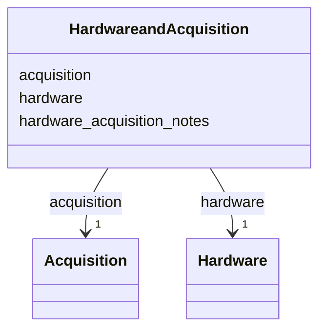

---
search:
  boost: 10.0
---

# Class: HardwareandAcquisition 


_Defines video hardware configuration (camera or microscope) and acquisiiton or recording parameters used during experiments._


<div data-search-exclude markdown="1">


URI: [BeStMeta:HardwareandAcquisition](https://w3id.org/BeStMeta/HardwareandAcquisition)





<!-- no inheritance hierarchy -->

## Slots

| Name | Cardinality and Range | Description | Inheritance |
| ---  | --- | --- | --- |
| [hardware](hardware.md) | 1 <br/> [Hardware](Hardware.md) | Hardware configuration used to record the video | direct |
| [acquisition](acquisition.md) | 1 <br/> [Acquisition](Acquisition.md) | Acquisition/recording parameters for the video | direct |
| [hardware_acquisition_notes](hardware_acquisition_notes.md) | 0..1 <br/> [String](String.md) | Free-text catch-all for additional context about the hardware and acquisition... | direct |


## Usages

| used by | used in | type | used |
| ---  | --- | --- | --- |
| [VTADataset](VTADataset.md) | [hardware_and_acquisition](hardware_and_acquisition.md) | range | [HardwareandAcquisition](HardwareandAcquisition.md) |


## Identifier and Mapping Information


### Schema Source


* from schema: https://w3id.org/bestmeta/schema


## Mappings

| Mapping Type | Mapped Value |
| ---  | ---  |
| self | BeStMeta:HardwareandAcquisition |
| native | BeStMeta:HardwareandAcquisition |


## LinkML Source

<!-- TODO: investigate https://stackoverflow.com/questions/37606292/how-to-create-tabbed-code-blocks-in-mkdocs-or-sphinx -->

### Direct

<details>
```yaml
name: HardwareandAcquisition
description: Defines video hardware configuration (camera or microscope) and acquisiiton
  or recording parameters used during experiments.
from_schema: https://w3id.org/bestmeta/schema
slots:
- hardware
- acquisition
- hardware_acquisition_notes

```
</details>

### Induced

<details>
```yaml
name: HardwareandAcquisition
description: Defines video hardware configuration (camera or microscope) and acquisiiton
  or recording parameters used during experiments.
from_schema: https://w3id.org/bestmeta/schema
attributes:
  hardware:
    name: hardware
    description: Hardware configuration used to record the video.
    from_schema: https://w3id.org/bestmeta/schema
    rank: 1000
    owner: HardwareandAcquisition
    domain_of:
    - HardwareandAcquisition
    range: Hardware
    required: true
    inlined: true
  acquisition:
    name: acquisition
    description: Acquisition/recording parameters for the video.
    from_schema: https://w3id.org/bestmeta/schema
    rank: 1000
    owner: HardwareandAcquisition
    domain_of:
    - HardwareandAcquisition
    range: Acquisition
    required: true
    inlined: true
  hardware_acquisition_notes:
    name: hardware_acquisition_notes
    description: Free-text catch-all for additional context about the hardware and
      acquisition setup as a whole that does not fit within hardware_notes or acquisition_notes
      specifically (e.g. deviations from standard protocol, or setup issues spanning
      both hardware and acquisition).
    from_schema: https://w3id.org/bestmeta/schema
    rank: 1000
    owner: HardwareandAcquisition
    domain_of:
    - HardwareandAcquisition
    range: string

```
</details></div>