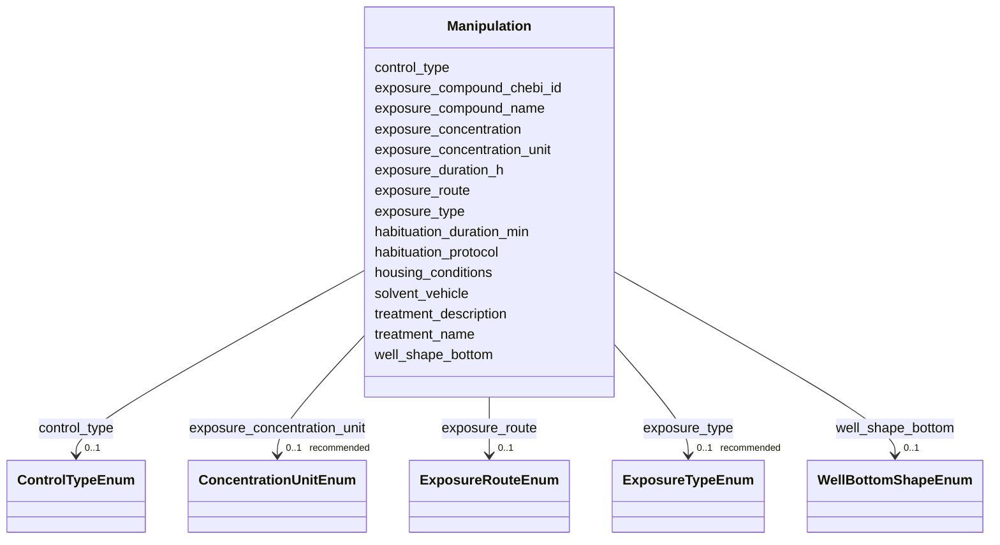

---
search:
  boost: 10.0
---

# Class: Manipulation 


_Treatment and chemical exposure information decribing pharmacological, toxicological and/or any other interventions that subjects went through. This sub-class can be omitted where no interventions were used._


<div data-search-exclude markdown="1">


URI: [BeStMeta:Manipulation](https://w3id.org/BeStMeta/Manipulation)





<!-- no inheritance hierarchy -->

## Slots

| Name | Cardinality and Range | Description | Inheritance |
| ---  | --- | --- | --- |
| [treatment_name](treatment_name.md) | 0..1 _recommended_ <br/> [String](String.md) | Short label identifying the experimental treatment group, condition, or regim... | direct |
| [treatment_description](treatment_description.md) | 0..1 _recommended_ <br/> [String](String.md) | Full description of the treatment protocol | direct |
| [exposure_compound_name](exposure_compound_name.md) | 0..1 _recommended_ <br/> [String](String.md) | Name of the chemical, drug, or substance used in the treatment or exposure | direct |
| [exposure_compound_chebi_id](exposure_compound_chebi_id.md) | 0..1 _recommended_ <br/> [String](String.md) | ChEBI identifier for the test substance | direct |
| [exposure_concentration](exposure_concentration.md) | 0..1 _recommended_ <br/> [Float](Float.md) | Nominal exposure concentration (numeric value only; use unit field) | direct |
| [exposure_concentration_unit](exposure_concentration_unit.md) | 0..1 _recommended_ <br/> [ConcentrationUnitEnum](ConcentrationUnitEnum.md) | Unit for exposure concentration | direct |
| [exposure_type](exposure_type.md) | 0..1 _recommended_ <br/> [ExposureTypeEnum](ExposureTypeEnum.md) | It indicates the type of exposure (Acute or chronic) | direct |
| [well_shape_bottom](well_shape_bottom.md) | 0..1 <br/> [WellBottomShapeEnum](WellBottomShapeEnum.md) | Geometric bottom shape of the wells of a multiwell plate | direct |
| [habituation_duration_min](habituation_duration_min.md) | 0..1 <br/> [Float](Float.md) | Duration of habituation period before recording, in minutes | direct |
| [habituation_protocol](habituation_protocol.md) | 0..1 <br/> [String](String.md) | Description of habituation or acclimation prior to testing | direct |
| [housing_conditions](housing_conditions.md) | 0..1 <br/> [String](String.md) | Free-text description of animal housing conditions prior to assay | direct |
| [exposure_route](exposure_route.md) | 0..1 <br/> [ExposureRouteEnum](ExposureRouteEnum.md) | Route of chemical or treatment administration | direct |
| [exposure_duration_h](exposure_duration_h.md) | 0..1 <br/> [Float](Float.md) | Duration of chemical or treatment exposure in hours | direct |
| [solvent_vehicle](solvent_vehicle.md) | 0..1 <br/> [String](String.md) | Solvent or vehicle used to dissolve the test substance | direct |
| [control_type](control_type.md) | 0..1 <br/> [ControlTypeEnum](ControlTypeEnum.md) | Type of control group used | direct |


## Usages

| used by | used in | type | used |
| ---  | --- | --- | --- |
| [ExperimentalConditions](ExperimentalConditions.md) | [manipulation](manipulation.md) | range | [Manipulation](Manipulation.md) |


## Rules


### 

| Rule Applied | Preconditions | Postconditions | Elseconditions |
|--------------|---------------|----------------|----------------|
| slot_conditions |```{'exposure_concentration': {'value_presence': 'PRESENT'}}``` |```{'exposure_concentration_unit': {'required': True}}``` | |


### 

| Rule Applied | Preconditions | Postconditions | Elseconditions |
|--------------|---------------|----------------|----------------|
| slot_conditions |```{'exposure_compound_chebi_id': {'value_presence': 'PRESENT'}}``` |```{'exposure_compound_name': {'recommended': True}}``` | |


## Identifier and Mapping Information


### Schema Source


* from schema: https://w3id.org/bestmeta/schema


## Mappings

| Mapping Type | Mapped Value |
| ---  | ---  |
| self | BeStMeta:Manipulation |
| native | BeStMeta:Manipulation |


## LinkML Source

<!-- TODO: investigate https://stackoverflow.com/questions/37606292/how-to-create-tabbed-code-blocks-in-mkdocs-or-sphinx -->

### Direct

<details>
```yaml
name: Manipulation
description: Treatment and chemical exposure information decribing pharmacological,
  toxicological and/or any other interventions that subjects went through. This sub-class
  can be omitted where no interventions were used.
from_schema: https://w3id.org/bestmeta/schema
slots:
- treatment_name
- treatment_description
- exposure_compound_name
- exposure_compound_chebi_id
- exposure_concentration
- exposure_concentration_unit
- exposure_type
- well_shape_bottom
- habituation_duration_min
- habituation_protocol
- housing_conditions
- exposure_route
- exposure_duration_h
- solvent_vehicle
- control_type
rules:
- preconditions:
    slot_conditions:
      exposure_concentration:
        name: exposure_concentration
        value_presence: PRESENT
  postconditions:
    slot_conditions:
      exposure_concentration_unit:
        name: exposure_concentration_unit
        required: true
  description: exposure_concentration requires exposure_concentration_unit.
- preconditions:
    slot_conditions:
      exposure_compound_chebi_id:
        name: exposure_compound_chebi_id
        value_presence: PRESENT
  postconditions:
    slot_conditions:
      exposure_compound_name:
        name: exposure_compound_name
        recommended: true
  description: exposure_compound_name is recommended when exposure_compound_chebi_id
    is provided.

```
</details>

### Induced

<details>
```yaml
name: Manipulation
description: Treatment and chemical exposure information decribing pharmacological,
  toxicological and/or any other interventions that subjects went through. This sub-class
  can be omitted where no interventions were used.
from_schema: https://w3id.org/bestmeta/schema
attributes:
  treatment_name:
    name: treatment_name
    description: Short label identifying the experimental treatment group, condition,
      or regimen.
    examples:
    - value: diazepam 1 mg/kg
    - value: atrazine 10 ug/L
    - value: vehicle control
    from_schema: https://w3id.org/bestmeta/schema
    exact_mappings:
    - NCIT:C82542
    rank: 1000
    owner: Manipulation
    domain_of:
    - Manipulation
    range: string
    required: false
    recommended: true
  treatment_description:
    name: treatment_description
    description: Full description of the treatment protocol.
    from_schema: https://w3id.org/bestmeta/schema
    rank: 1000
    owner: Manipulation
    domain_of:
    - Manipulation
    range: string
    required: false
    recommended: true
  exposure_compound_name:
    name: exposure_compound_name
    description: Name of the chemical, drug, or substance used in the treatment or
      exposure.
    from_schema: https://w3id.org/bestmeta/schema
    exact_mappings:
    - EDAM.DATA:0997
    rank: 1000
    owner: Manipulation
    domain_of:
    - Manipulation
    range: string
    required: false
    recommended: true
  exposure_compound_chebi_id:
    name: exposure_compound_chebi_id
    description: ChEBI identifier for the test substance.
    examples:
    - value: CHEBI:15930
    - value: CHEBI:49575
    from_schema: https://w3id.org/bestmeta/schema
    exact_mappings:
    - EDAM.DATA:1174
    rank: 1000
    owner: Manipulation
    domain_of:
    - Manipulation
    range: string
    required: false
    recommended: true
    pattern: ^CHEBI:\d+$
  exposure_concentration:
    name: exposure_concentration
    description: Nominal exposure concentration (numeric value only; use unit field).
    from_schema: https://w3id.org/bestmeta/schema
    exact_mappings:
    - EDAM.DATA:2140
    rank: 1000
    owner: Manipulation
    domain_of:
    - Manipulation
    range: float
    required: false
    recommended: true
  exposure_concentration_unit:
    name: exposure_concentration_unit
    description: Unit for exposure concentration.
    from_schema: https://w3id.org/bestmeta/schema
    rank: 1000
    owner: Manipulation
    domain_of:
    - Manipulation
    range: ConcentrationUnitEnum
    required: false
    recommended: true
  exposure_type:
    name: exposure_type
    description: It indicates the type of exposure (Acute or chronic)
    from_schema: https://w3id.org/bestmeta/schema
    rank: 1000
    owner: Manipulation
    domain_of:
    - Manipulation
    range: ExposureTypeEnum
    required: false
    recommended: true
  well_shape_bottom:
    name: well_shape_bottom
    description: Geometric bottom shape of the wells of a multiwell plate.
    from_schema: https://w3id.org/bestmeta/schema
    rank: 1000
    owner: Manipulation
    domain_of:
    - Manipulation
    range: WellBottomShapeEnum
    required: false
  habituation_duration_min:
    name: habituation_duration_min
    description: Duration of habituation period before recording, in minutes
    from_schema: https://w3id.org/bestmeta/schema
    rank: 1000
    owner: Manipulation
    domain_of:
    - Manipulation
    range: float
    required: false
    unit:
      ucum_code: min
  habituation_protocol:
    name: habituation_protocol
    description: Description of habituation or acclimation prior to testing.
    from_schema: https://w3id.org/bestmeta/schema
    rank: 1000
    owner: Manipulation
    domain_of:
    - Manipulation
    range: string
    required: false
  housing_conditions:
    name: housing_conditions
    description: Free-text description of animal housing conditions prior to assay.
    from_schema: https://w3id.org/bestmeta/schema
    exact_mappings:
    - XCO:0000033
    rank: 1000
    owner: Manipulation
    domain_of:
    - Subject
    - Manipulation
    range: string
    required: false
  exposure_route:
    name: exposure_route
    description: Route of chemical or treatment administration.
    from_schema: https://w3id.org/bestmeta/schema
    exact_mappings:
    - MESH:D004333
    rank: 1000
    owner: Manipulation
    domain_of:
    - Manipulation
    range: ExposureRouteEnum
    required: false
  exposure_duration_h:
    name: exposure_duration_h
    description: Duration of chemical or treatment exposure in hours.
    from_schema: https://w3id.org/bestmeta/schema
    rank: 1000
    owner: Manipulation
    domain_of:
    - Manipulation
    range: float
    required: false
    unit:
      ucum_code: h
  solvent_vehicle:
    name: solvent_vehicle
    description: Solvent or vehicle used to dissolve the test substance.
    examples:
    - value: DMSO 0.01%
    - value: ethanol 0.1%
    - value: water
    from_schema: https://w3id.org/bestmeta/schema
    rank: 1000
    owner: Manipulation
    domain_of:
    - Manipulation
    range: string
    required: false
  control_type:
    name: control_type
    description: Type of control group used.
    from_schema: https://w3id.org/bestmeta/schema
    exact_mappings:
    - NCIT:C178849
    rank: 1000
    owner: Manipulation
    domain_of:
    - Manipulation
    range: ControlTypeEnum
    required: false
rules:
- preconditions:
    slot_conditions:
      exposure_concentration:
        name: exposure_concentration
        value_presence: PRESENT
  postconditions:
    slot_conditions:
      exposure_concentration_unit:
        name: exposure_concentration_unit
        required: true
  description: exposure_concentration requires exposure_concentration_unit.
- preconditions:
    slot_conditions:
      exposure_compound_chebi_id:
        name: exposure_compound_chebi_id
        value_presence: PRESENT
  postconditions:
    slot_conditions:
      exposure_compound_name:
        name: exposure_compound_name
        recommended: true
  description: exposure_compound_name is recommended when exposure_compound_chebi_id
    is provided.

```
</details></div>