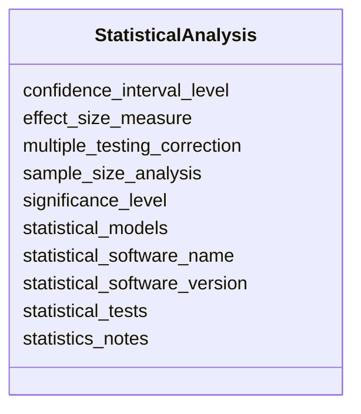

---
search:
  boost: 10.0
---

# Class: StatisticalAnalysis 


_Information describing the statistical analysis of behavioral data, including statistical tests, models, significance criteria, multiple-testing corrections, and other methods used to evaluate experimental outcomes._


<div data-search-exclude markdown="1">


URI: [BeStMeta:StatisticalAnalysis](https://w3id.org/BeStMeta/StatisticalAnalysis)





<!-- no inheritance hierarchy -->

## Slots

| Name | Cardinality and Range | Description | Inheritance |
| ---  | --- | --- | --- |
| [statistical_software_name](statistical_software_name.md) | 0..1 _recommended_ <br/> [String](String.md) | Name of the software used for statistical analysis | direct |
| [statistical_software_version](statistical_software_version.md) | 0..1 _recommended_ <br/> [String](String.md) | Version string of the software used for statistical analysis | direct |
| [statistical_tests](statistical_tests.md) | * _recommended_ <br/> [String](String.md) | Statistical tests applied to behavioral endpoints for hypothesis testing or i... | direct |
| [statistical_models](statistical_models.md) | * _recommended_ <br/> [String](String.md) | Statistical models used to analyse behavioral endpoints | direct |
| [multiple_testing_correction](multiple_testing_correction.md) | 0..1 _recommended_ <br/> [String](String.md) | Procedure used to correct for multiple comparisons (if more than one hypothes... | direct |
| [significance_level](significance_level.md) | 0..1 _recommended_ <br/> [Float](Float.md) | Significance threshold used for hypothesis testing (e | direct |
| [effect_size_measure](effect_size_measure.md) | * _recommended_ <br/> [String](String.md) | Effect size measure reported to quantify the magnitude of observed effects or... | direct |
| [confidence_interval_level](confidence_interval_level.md) | * _recommended_ <br/> [String](String.md) | Confidence interval reported for statistical results | direct |
| [sample_size_analysis](sample_size_analysis.md) | * _recommended_ <br/> [String](String.md) | Sample size or power analysis method, software, or justification used before ... | direct |
| [statistics_notes](statistics_notes.md) | 0..1 <br/> [String](String.md) | Free-text notes on the statistical analysis not captured by structured fields | direct |


## Usages

| used by | used in | type | used |
| ---  | --- | --- | --- |
| [VTADataset](VTADataset.md) | [statistical_analysis](statistical_analysis.md) | range | [StatisticalAnalysis](StatisticalAnalysis.md) |


## Identifier and Mapping Information


### Schema Source


* from schema: https://w3id.org/bestmeta/schema


## Mappings

| Mapping Type | Mapped Value |
| ---  | ---  |
| self | BeStMeta:StatisticalAnalysis |
| native | BeStMeta:StatisticalAnalysis |


## LinkML Source

<!-- TODO: investigate https://stackoverflow.com/questions/37606292/how-to-create-tabbed-code-blocks-in-mkdocs-or-sphinx -->

### Direct

<details>
```yaml
name: StatisticalAnalysis
description: Information describing the statistical analysis of behavioral data, including
  statistical tests, models, significance criteria, multiple-testing corrections,
  and other methods used to evaluate experimental outcomes.
from_schema: https://w3id.org/bestmeta/schema
slots:
- statistical_software_name
- statistical_software_version
- statistical_tests
- statistical_models
- multiple_testing_correction
- significance_level
- effect_size_measure
- confidence_interval_level
- sample_size_analysis
- statistics_notes

```
</details>

### Induced

<details>
```yaml
name: StatisticalAnalysis
description: Information describing the statistical analysis of behavioral data, including
  statistical tests, models, significance criteria, multiple-testing corrections,
  and other methods used to evaluate experimental outcomes.
from_schema: https://w3id.org/bestmeta/schema
attributes:
  statistical_software_name:
    name: statistical_software_name
    description: Name of the software used for statistical analysis.
    notes:
    - Use a software/package name rather than a software class or workflow.
    examples:
    - value: R
    - value: GraphPad Prism
    - value: SPSS
    - value: SAS
    - value: Stata
    from_schema: https://w3id.org/bestmeta/schema
    exact_mappings:
    - AFR:0002802
    rank: 1000
    owner: StatisticalAnalysis
    domain_of:
    - StatisticalAnalysis
    range: string
    required: false
    recommended: true
  statistical_software_version:
    name: statistical_software_version
    description: Version string of the software used for statistical analysis.
    from_schema: https://w3id.org/bestmeta/schema
    exact_mappings:
    - AFR:0001700
    rank: 1000
    owner: StatisticalAnalysis
    domain_of:
    - StatisticalAnalysis
    range: string
    required: false
    recommended: true
  statistical_tests:
    name: statistical_tests
    description: Statistical tests applied to behavioral endpoints for hypothesis
      testing or inference.
    notes:
    - Multiple tests may be listed if different endpoints were analysed with different
      methods.
    examples:
    - value: Student's t-test
    - value: Mann-Whitney U test
    - value: one-way ANOVA
    - value: two-way ANOVA
    - value: repeated-measures ANOVA
    - value: Kruskal-Wallis test
    - value: Wilcoxon signed-rank test
    - value: Chi-square test
    from_schema: https://w3id.org/bestmeta/schema
    exact_mappings:
    - NCIT:C53228
    rank: 1000
    owner: StatisticalAnalysis
    domain_of:
    - StatisticalAnalysis
    range: string
    required: false
    recommended: true
    multivalued: true
  statistical_models:
    name: statistical_models
    description: Statistical models used to analyse behavioral endpoints.
    examples:
    - value: linear mixed-effects model
    - value: generalized linear model
    - value: generalized additive model
    - value: Cox proportional hazards model
    - value: logistic regression
    from_schema: https://w3id.org/bestmeta/schema
    exact_mappings:
    - STATO:0000107
    rank: 1000
    owner: StatisticalAnalysis
    domain_of:
    - StatisticalAnalysis
    range: string
    required: false
    recommended: true
    multivalued: true
  multiple_testing_correction:
    name: multiple_testing_correction
    description: Procedure used to correct for multiple comparisons (if more than
      one hypothesis was tested).  Include the name of the method and any parameters
      (e.g., false‑discovery‑rate level).
    examples:
    - value: Benjamini‑Hochberg FDR (q = 0.05)
    - value: Bonferroni (α / n = 0.001)
    from_schema: https://w3id.org/bestmeta/schema
    exact_mappings:
    - OBI:0200089
    rank: 1000
    owner: StatisticalAnalysis
    domain_of:
    - StatisticalAnalysis
    range: string
    required: false
    recommended: true
  significance_level:
    name: significance_level
    description: Significance threshold used for hypothesis testing (e.g., alpha).
    examples:
    - value: '0.05'
    - value: '0.01'
    from_schema: https://w3id.org/bestmeta/schema
    exact_mappings:
    - NCIT:C41265
    rank: 1000
    owner: StatisticalAnalysis
    domain_of:
    - StatisticalAnalysis
    range: float
    required: false
    recommended: true
    minimum_value: 0
    maximum_value: 1
  effect_size_measure:
    name: effect_size_measure
    description: Effect size measure reported to quantify the magnitude of observed
      effects or associations.
    examples:
    - value: Cohen's d
    - value: Hedges' g
    - value: eta-squared
    - value: partial eta-squared
    - value: odds ratio
    - value: Pearson's r
    - value: Spearman's rho
    from_schema: https://w3id.org/bestmeta/schema
    close_mappings:
    - NCIT:C209463
    rank: 1000
    owner: StatisticalAnalysis
    domain_of:
    - StatisticalAnalysis
    range: string
    required: false
    recommended: true
    multivalued: true
  confidence_interval_level:
    name: confidence_interval_level
    description: Confidence interval reported for statistical results.
    examples:
    - value: 95% CI
    from_schema: https://w3id.org/bestmeta/schema
    exact_mappings:
    - STATO:0000196
    rank: 1000
    owner: StatisticalAnalysis
    domain_of:
    - StatisticalAnalysis
    range: string
    required: false
    recommended: true
    multivalued: true
  sample_size_analysis:
    name: sample_size_analysis
    description: Sample size or power analysis method, software, or justification
      used before the study.
    examples:
    - value: power analysis in G*Power
    - value: calculated using alpha=0.05 and power=0.8
    from_schema: https://w3id.org/bestmeta/schema
    exact_mappings:
    - NCIT:C115467
    rank: 1000
    owner: StatisticalAnalysis
    domain_of:
    - StatisticalAnalysis
    range: string
    required: false
    recommended: true
    multivalued: true
  statistics_notes:
    name: statistics_notes
    description: Free-text notes on the statistical analysis not captured by structured
      fields.
    from_schema: https://w3id.org/bestmeta/schema
    rank: 1000
    owner: StatisticalAnalysis
    domain_of:
    - StatisticalAnalysis
    range: string
    required: false

```
</details></div>