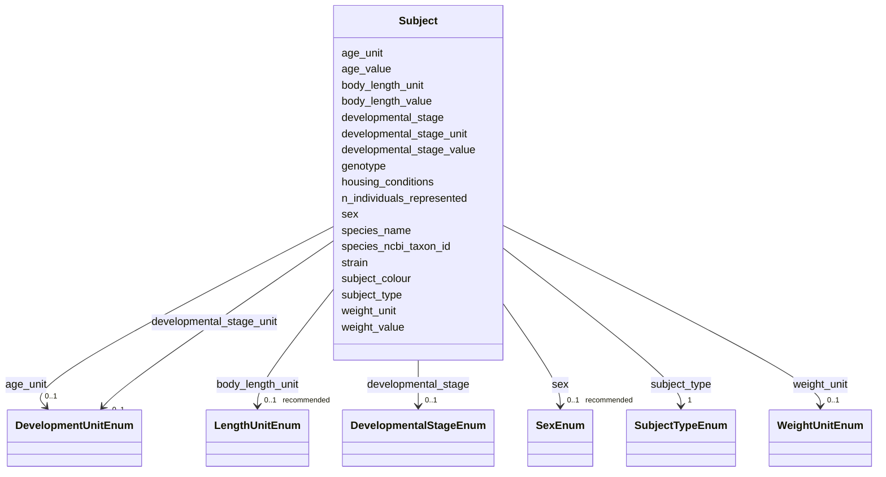

---
search:
  boost: 10.0
---

# Class: Subject 


_Biological identity of the organism(s) that is studied. Contains details like taxonomy, strain, genotype, sex, age and/or other morphometric details and measurements._


<div data-search-exclude markdown="1">


URI: [BeStMeta:Subject](https://w3id.org/BeStMeta/Subject)





<!-- no inheritance hierarchy -->

## Slots

| Name | Cardinality and Range | Description | Inheritance |
| ---  | --- | --- | --- |
| [subject_type](subject_type.md) | 1 <br/> [SubjectTypeEnum](SubjectTypeEnum.md) | Indicates whether the subject being tracked is a whole organism or a cell/cel... | direct |
| [species_name](species_name.md) | 1 <br/> [String](String.md) | Scientific (Latin) binomial name of the study organism | direct |
| [n_individuals_represented](n_individuals_represented.md) | 0..1 <br/> [Integer](Integer.md) | Represents the toal number of individual subjects in a given subject entry | direct |
| [species_ncbi_taxon_id](species_ncbi_taxon_id.md) | 0..1 _recommended_ <br/> [String](String.md) | NCBI Taxonomy ID for the study organism | direct |
| [strain](strain.md) | 0..1 _recommended_ <br/> [String](String.md) | Organism strain or line | direct |
| [genotype](genotype.md) | 0..1 _recommended_ <br/> [String](String.md) | Genotype identifier of the tracked organism(s) including strain-specific, mut... | direct |
| [sex](sex.md) | 0..1 _recommended_ <br/> [SexEnum](SexEnum.md) | Biological sex of the tracked organism(s) | direct |
| [body_length_value](body_length_value.md) | 0..1 _recommended_ <br/> [Float](Float.md) | Body length numeric value of the tracked organism(s) | direct |
| [body_length_unit](body_length_unit.md) | 0..1 _recommended_ <br/> [LengthUnitEnum](LengthUnitEnum.md) | Body length unit of the tracked organism(s) | direct |
| [housing_conditions](housing_conditions.md) | 0..1 <br/> [String](String.md) | Free-text description of animal housing conditions prior to assay | direct |
| [subject_colour](subject_colour.md) | 0..1 <br/> [String](String.md) | Indicates the colour of the subject | direct |
| [developmental_stage](developmental_stage.md) | 0..1 <br/> [DevelopmentalStageEnum](DevelopmentalStageEnum.md) | Developmental stage of the tracked organism(s) | direct |
| [developmental_stage_value](developmental_stage_value.md) | 0..1 <br/> [Float](Float.md) | Numeric developmental stage value (e | direct |
| [developmental_stage_unit](developmental_stage_unit.md) | 0..1 <br/> [DevelopmentUnitEnum](DevelopmentUnitEnum.md) | Unit for developmental stage value of the tracked organism(s) | direct |
| [age_value](age_value.md) | 0..1 <br/> [Float](Float.md) | Numeric age value of the tracked organism(s) | direct |
| [age_unit](age_unit.md) | 0..1 <br/> [DevelopmentUnitEnum](DevelopmentUnitEnum.md) | Age unit of the tracked organism(s) | direct |
| [weight_value](weight_value.md) | 0..1 <br/> [Float](Float.md) | Body weight numeric value of the tracked organism(s) | direct |
| [weight_unit](weight_unit.md) | 0..1 <br/> [WeightUnitEnum](WeightUnitEnum.md) | Body weight unit of the tracked organism(s) | direct |

<details>
<summary>Expressions & Logic</summary>
#### Any Of

The class must satisfy at least one of:
- AnonymousClassExpression({
  'slot_conditions': {'developmental_stage': SlotDefinition({'name': 'developmental_stage', 'required': True})}
})
- AnonymousClassExpression({
  'slot_conditions': {'developmental_stage_value': SlotDefinition({'name': 'developmental_stage_value', 'required': True}),
    'developmental_stage_unit': SlotDefinition({'name': 'developmental_stage_unit', 'required': True})}
})
- AnonymousClassExpression({
  'slot_conditions': {'age_value': SlotDefinition({'name': 'age_value', 'required': True}),
    'age_unit': SlotDefinition({'name': 'age_unit', 'required': True})}
})

</details>


## Usages

| used by | used in | type | used |
| ---  | --- | --- | --- |
| [ExperimentalConditions](ExperimentalConditions.md) | [subject](subject.md) | range | [Subject](Subject.md) |


## Rules


### 

| Rule Applied | Preconditions | Postconditions | Elseconditions |
|--------------|---------------|----------------|----------------|
| slot_conditions |```{'subject_type': {'equals_string': 'organism'}}``` |```{'sex': {'recommended': True}}``` | |


### 

| Rule Applied | Preconditions | Postconditions | Elseconditions |
|--------------|---------------|----------------|----------------|
| slot_conditions |```{'body_length_value': {'value_presence': 'PRESENT'}}``` |```{'body_length_unit': {'required': True}}``` | |


### 

| Rule Applied | Preconditions | Postconditions | Elseconditions |
|--------------|---------------|----------------|----------------|
| slot_conditions |```{'weight_value': {'value_presence': 'PRESENT'}}``` |```{'weight_unit': {'required': True}}``` | |


## Identifier and Mapping Information


### Schema Source


* from schema: https://w3id.org/bestmeta/schema


## Mappings

| Mapping Type | Mapped Value |
| ---  | ---  |
| self | BeStMeta:Subject |
| native | BeStMeta:Subject |


## LinkML Source

<!-- TODO: investigate https://stackoverflow.com/questions/37606292/how-to-create-tabbed-code-blocks-in-mkdocs-or-sphinx -->

### Direct

<details>
```yaml
name: Subject
description: Biological identity of the organism(s) that is studied. Contains details
  like taxonomy, strain, genotype, sex, age and/or other morphometric details and
  measurements.
from_schema: https://w3id.org/bestmeta/schema
slots:
- subject_type
- species_name
- n_individuals_represented
- species_ncbi_taxon_id
- strain
- genotype
- sex
- body_length_value
- body_length_unit
- housing_conditions
- subject_colour
- developmental_stage
- developmental_stage_value
- developmental_stage_unit
- age_value
- age_unit
- weight_value
- weight_unit
rules:
- preconditions:
    slot_conditions:
      subject_type:
        name: subject_type
        equals_string: organism
  postconditions:
    slot_conditions:
      sex:
        name: sex
        recommended: true
  description: 'When subject_type is organism, sex is a recommended field. '
- preconditions:
    slot_conditions:
      body_length_value:
        name: body_length_value
        value_presence: PRESENT
  postconditions:
    slot_conditions:
      body_length_unit:
        name: body_length_unit
        required: true
  description: body_length_value requires body_length_unit
- preconditions:
    slot_conditions:
      weight_value:
        name: weight_value
        value_presence: PRESENT
  postconditions:
    slot_conditions:
      weight_unit:
        name: weight_unit
        required: true
  description: weight_value requires weight_unit
any_of:
- slot_conditions:
    developmental_stage:
      name: developmental_stage
      required: true
- slot_conditions:
    developmental_stage_value:
      name: developmental_stage_value
      required: true
    developmental_stage_unit:
      name: developmental_stage_unit
      required: true
- slot_conditions:
    age_value:
      name: age_value
      required: true
    age_unit:
      name: age_unit
      required: true

```
</details>

### Induced

<details>
```yaml
name: Subject
description: Biological identity of the organism(s) that is studied. Contains details
  like taxonomy, strain, genotype, sex, age and/or other morphometric details and
  measurements.
from_schema: https://w3id.org/bestmeta/schema
attributes:
  subject_type:
    name: subject_type
    description: Indicates whether the subject being tracked is a whole organism or
      a cell/cell culture; determines which biological identity fields are applicable.
    from_schema: https://w3id.org/bestmeta/schema
    rank: 1000
    owner: Subject
    domain_of:
    - Subject
    range: SubjectTypeEnum
    required: true
  species_name:
    name: species_name
    description: Scientific (Latin) binomial name of the study organism
    examples:
    - value: Danio rerio
    - value: Mus musculus
    - value: Daphnia magna
    from_schema: https://w3id.org/bestmeta/schema
    exact_mappings:
    - dwc:scientificName
    - EDAM.DATA:1045
    rank: 1000
    owner: Subject
    domain_of:
    - Subject
    range: string
    required: true
  n_individuals_represented:
    name: n_individuals_represented
    description: Represents the toal number of individual subjects in a given subject
      entry. Use a value greater than one to show its a homogenous subjects. Defaults
      to one (when omitted)
    from_schema: https://w3id.org/bestmeta/schema
    rank: 1000
    owner: Subject
    domain_of:
    - Subject
    range: integer
  species_ncbi_taxon_id:
    name: species_ncbi_taxon_id
    description: NCBI Taxonomy ID for the study organism
    examples:
    - value: '7955'
    - value: '10090'
    from_schema: https://w3id.org/bestmeta/schema
    exact_mappings:
    - dwc:taxonID
    - EDAM.DATA:1179
    rank: 1000
    owner: Subject
    domain_of:
    - Subject
    range: string
    required: false
    recommended: true
    pattern: ^\d+$
  strain:
    name: strain
    description: Organism strain or line
    from_schema: https://w3id.org/bestmeta/schema
    exact_mappings:
    - EDAM.DATA:2379
    rank: 1000
    owner: Subject
    domain_of:
    - Subject
    range: string
    required: false
    recommended: true
  genotype:
    name: genotype
    annotations:
      source_ontology:
        tag: source_ontology
        value: GENO
    description: Genotype identifier of the tracked organism(s) including strain-specific,
      mutant, transgenic, or engineered genotypes.
    from_schema: https://w3id.org/bestmeta/schema
    exact_mappings:
    - EFO:0000513
    - GENO:0000536
    rank: 1000
    owner: Subject
    domain_of:
    - Subject
    range: string
    required: false
    recommended: true
  sex:
    name: sex
    description: Biological sex of the tracked organism(s).
    from_schema: https://w3id.org/bestmeta/schema
    exact_mappings:
    - PATO:0000047
    rank: 1000
    owner: Subject
    domain_of:
    - Subject
    range: SexEnum
    required: false
    recommended: true
  body_length_value:
    name: body_length_value
    description: Body length numeric value of the tracked organism(s).
    from_schema: https://w3id.org/bestmeta/schema
    close_mappings:
    - EFO:0004339
    - MESH:D049628
    rank: 1000
    owner: Subject
    domain_of:
    - Subject
    range: float
    required: false
    recommended: true
  body_length_unit:
    name: body_length_unit
    description: Body length unit of the tracked organism(s).
    from_schema: https://w3id.org/bestmeta/schema
    rank: 1000
    owner: Subject
    domain_of:
    - Subject
    range: LengthUnitEnum
    required: false
    recommended: true
  housing_conditions:
    name: housing_conditions
    description: Free-text description of animal housing conditions prior to assay.
    from_schema: https://w3id.org/bestmeta/schema
    exact_mappings:
    - XCO:0000033
    rank: 1000
    owner: Subject
    domain_of:
    - Subject
    - Manipulation
    range: string
    required: false
  subject_colour:
    name: subject_colour
    description: Indicates the colour of the subject. This is useful for tracking.
    from_schema: https://w3id.org/bestmeta/schema
    rank: 1000
    owner: Subject
    domain_of:
    - Subject
    range: string
  developmental_stage:
    name: developmental_stage
    description: Developmental stage of the tracked organism(s).
    from_schema: https://w3id.org/bestmeta/schema
    exact_mappings:
    - EFO:0000399
    rank: 1000
    owner: Subject
    domain_of:
    - Subject
    range: DevelopmentalStageEnum
  developmental_stage_value:
    name: developmental_stage_value
    description: Numeric developmental stage value (e.g. 72 for 72 hpf) of the tracked
      organism(s).
    from_schema: https://w3id.org/bestmeta/schema
    close_mappings:
    - EFO:0000399
    rank: 1000
    owner: Subject
    domain_of:
    - Subject
    range: float
  developmental_stage_unit:
    name: developmental_stage_unit
    description: Unit for developmental stage value of the tracked organism(s).
    from_schema: https://w3id.org/bestmeta/schema
    rank: 1000
    owner: Subject
    domain_of:
    - Subject
    range: DevelopmentUnitEnum
  age_value:
    name: age_value
    description: Numeric age value of the tracked organism(s).
    from_schema: https://w3id.org/bestmeta/schema
    exact_mappings:
    - EFO:0000246
    rank: 1000
    owner: Subject
    domain_of:
    - Subject
    range: float
  age_unit:
    name: age_unit
    description: Age unit of the tracked organism(s).
    from_schema: https://w3id.org/bestmeta/schema
    rank: 1000
    owner: Subject
    domain_of:
    - Subject
    range: DevelopmentUnitEnum
  weight_value:
    name: weight_value
    description: Body weight numeric value of the tracked organism(s).
    from_schema: https://w3id.org/bestmeta/schema
    exact_mappings:
    - EFO:0004338
    rank: 1000
    owner: Subject
    domain_of:
    - Subject
    range: float
    required: false
  weight_unit:
    name: weight_unit
    description: Body weight unit of the tracked organism(s).
    from_schema: https://w3id.org/bestmeta/schema
    rank: 1000
    owner: Subject
    domain_of:
    - Subject
    range: WeightUnitEnum
    required: false
rules:
- preconditions:
    slot_conditions:
      subject_type:
        name: subject_type
        equals_string: organism
  postconditions:
    slot_conditions:
      sex:
        name: sex
        recommended: true
  description: 'When subject_type is organism, sex is a recommended field. '
- preconditions:
    slot_conditions:
      body_length_value:
        name: body_length_value
        value_presence: PRESENT
  postconditions:
    slot_conditions:
      body_length_unit:
        name: body_length_unit
        required: true
  description: body_length_value requires body_length_unit
- preconditions:
    slot_conditions:
      weight_value:
        name: weight_value
        value_presence: PRESENT
  postconditions:
    slot_conditions:
      weight_unit:
        name: weight_unit
        required: true
  description: weight_value requires weight_unit
any_of:
- slot_conditions:
    developmental_stage:
      name: developmental_stage
      required: true
- slot_conditions:
    developmental_stage_value:
      name: developmental_stage_value
      required: true
    developmental_stage_unit:
      name: developmental_stage_unit
      required: true
- slot_conditions:
    age_value:
      name: age_value
      required: true
    age_unit:
      name: age_unit
      required: true

```
</details></div>