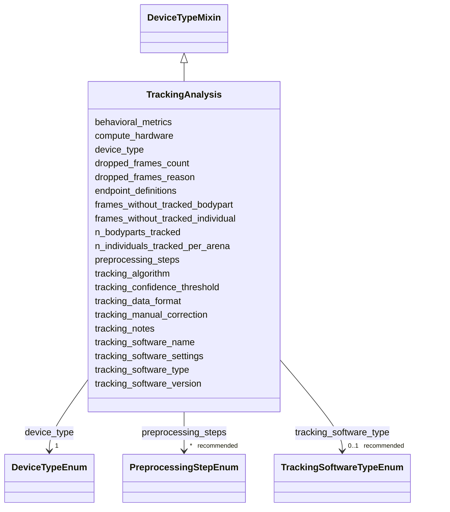

---
search:
  boost: 10.0
---

# Class: TrackingAnalysis 


_Tracking software identity and version, algorithm details, post-tracking computational steps and derived behavioral metrics._


<div data-search-exclude markdown="1">


URI: [BeStMeta:TrackingAnalysis](https://w3id.org/BeStMeta/TrackingAnalysis)





## Inheritance
* **TrackingAnalysis** [ [DeviceTypeMixin](DeviceTypeMixin.md)]


## Slots

| Name | Cardinality and Range | Description | Inheritance |
| ---  | --- | --- | --- |
| [tracking_software_name](tracking_software_name.md) | 1 <br/> [String](String.md) | Name of the software used for tracking | direct |
| [tracking_algorithm](tracking_algorithm.md) | * _recommended_ <br/> [String](String.md) | Algorithmic approach used to detect, identify, and track organisms in video r... | direct |
| [tracking_software_type](tracking_software_type.md) | 0..1 _recommended_ <br/> [TrackingSoftwareTypeEnum](TrackingSoftwareTypeEnum.md) | Indicates whether the tracking analysis was performed using a custom software... | direct |
| [tracking_software_version](tracking_software_version.md) | 0..1 _recommended_ <br/> [String](String.md) | Version string of the tracking software | direct |
| [tracking_software_settings](tracking_software_settings.md) | 0..1 _recommended_ <br/> [String](String.md) | Key tracking configuration parameters used during analysis, including softwar... | direct |
| [tracking_data_format](tracking_data_format.md) | * _recommended_ <br/> [String](String.md) | File format used to store tracking results, including coordinates, keypoints,... | direct |
| [tracking_confidence_threshold](tracking_confidence_threshold.md) | 0..1 _recommended_ <br/> [Float](Float.md) | Confidence or likelihood threshold used to accept detections, identities, tra... | direct |
| [tracking_manual_correction](tracking_manual_correction.md) | 0..1 _recommended_ <br/> [Boolean](Boolean.md) | Whether tracking results were manually reviewed, corrected, or curated after ... | direct |
| [compute_hardware](compute_hardware.md) | * _recommended_ <br/> [String](String.md) | Primary compute hardware used for tracking and analysis | direct |
| [preprocessing_steps](preprocessing_steps.md) | * _recommended_ <br/> [PreprocessingStepEnum](PreprocessingStepEnum.md) | Preprocessing steps applied to video before tracking to enhance quality or is... | direct |
| [n_individuals_tracked_per_arena](n_individuals_tracked_per_arena.md) | 0..1 _recommended_ <br/> [Integer](Integer.md) | Number of individuals actually tracked in a single arena or trial | direct |
| [n_bodyparts_tracked](n_bodyparts_tracked.md) | 0..1 _recommended_ <br/> [Integer](Integer.md) | Number of body parts or keypoints tracked per individual | direct |
| [dropped_frames_count](dropped_frames_count.md) | 0..1 _recommended_ <br/> [Integer](Integer.md) | Number of video frames lost or omitted during acquisition | direct |
| [frames_without_tracked_individual](frames_without_tracked_individual.md) | 0..1 _recommended_ <br/> [Float](Float.md) | Percentage of frames in which no individual was tracked | direct |
| [frames_without_tracked_bodypart](frames_without_tracked_bodypart.md) | 0..1 _recommended_ <br/> [Float](Float.md) | Percentage of frames in which no body part was tracked | direct |
| [behavioral_metrics](behavioral_metrics.md) | * _recommended_ <br/> [String](String.md) | List of behavioral metrics or endpoints extracted from tracking data | direct |
| [endpoint_definitions](endpoint_definitions.md) | * _recommended_ <br/> [String](String.md) | Definitions and calculation criteria used for behavioral endpoints, including... | direct |
| [dropped_frames_reason](dropped_frames_reason.md) | 0..1 <br/> [String](String.md) | Reason for dropped or omitted frames during acquisition, recording, encoding,... | direct |
| [tracking_notes](tracking_notes.md) | 0..1 <br/> [String](String.md) | Free-text notes on the tracking analysis not captured by structured fields | direct |
| [device_type](device_type.md) | 1 <br/> [DeviceTypeEnum](DeviceTypeEnum.md) | Indicates the category of imaging system used; determines which additional ha... | [DeviceTypeMixin](DeviceTypeMixin.md) |


## Usages

| used by | used in | type | used |
| ---  | --- | --- | --- |
| [VTADataset](VTADataset.md) | [tracking_analysis](tracking_analysis.md) | range | [TrackingAnalysis](TrackingAnalysis.md) |


## Rules


### 

| Rule Applied | Preconditions | Postconditions | Elseconditions |
|--------------|---------------|----------------|----------------|
| slot_conditions |```{'device_type': {'any_of': [{'equals_string': 'camera'}, {'equals_string': 'microscope'}]}}``` |```{'tracking_algorithm': {'value_presence': 'PRESENT'}}``` | |


### 

| Rule Applied | Preconditions | Postconditions | Elseconditions |
|--------------|---------------|----------------|----------------|
| slot_conditions |```{'device_type': {'any_of': [{'equals_string': 'closed_box_system'}, {'equals_string': 'in_house_system'}]}}``` |```{'tracking_algorithm': {'recommended': True}}``` | |


## Identifier and Mapping Information


### Schema Source


* from schema: https://w3id.org/bestmeta/schema


## Mappings

| Mapping Type | Mapped Value |
| ---  | ---  |
| self | BeStMeta:TrackingAnalysis |
| native | BeStMeta:TrackingAnalysis |


## LinkML Source

<!-- TODO: investigate https://stackoverflow.com/questions/37606292/how-to-create-tabbed-code-blocks-in-mkdocs-or-sphinx -->

### Direct

<details>
```yaml
name: TrackingAnalysis
description: Tracking software identity and version, algorithm details, post-tracking
  computational steps and derived behavioral metrics.
from_schema: https://w3id.org/bestmeta/schema
mixins:
- DeviceTypeMixin
slots:
- tracking_software_name
- tracking_algorithm
- tracking_software_type
- tracking_software_version
- tracking_software_settings
- tracking_data_format
- tracking_confidence_threshold
- tracking_manual_correction
- compute_hardware
- preprocessing_steps
- n_individuals_tracked_per_arena
- n_bodyparts_tracked
- dropped_frames_count
- frames_without_tracked_individual
- frames_without_tracked_bodypart
- behavioral_metrics
- endpoint_definitions
- dropped_frames_reason
- tracking_notes
rules:
- preconditions:
    slot_conditions:
      device_type:
        name: device_type
        any_of:
        - equals_string: camera
        - equals_string: microscope
  postconditions:
    slot_conditions:
      tracking_algorithm:
        name: tracking_algorithm
        value_presence: PRESENT
  description: '[ALGORITHM - required for camera/microscope] Tracking algorithm is
    required for camera and microscope systems, where the algorithm used is knowable
    and documentable.'
- preconditions:
    slot_conditions:
      device_type:
        name: device_type
        any_of:
        - equals_string: closed_box_system
        - equals_string: in_house_system
  postconditions:
    slot_conditions:
      tracking_algorithm:
        name: tracking_algorithm
        recommended: true
  description: '[ALGORITHM - recommended for closed-box/in-house] When device_type
    is closed_box_system or in_house_system, tracking algorithm is recommended but
    not required. Closed-box systems often don''t disclose their underlying algorithm;
    in-house systems may use informal or evolving methods not yet formally documented.'

```
</details>

### Induced

<details>
```yaml
name: TrackingAnalysis
description: Tracking software identity and version, algorithm details, post-tracking
  computational steps and derived behavioral metrics.
from_schema: https://w3id.org/bestmeta/schema
mixins:
- DeviceTypeMixin
attributes:
  tracking_software_name:
    name: tracking_software_name
    description: Name of the software used for tracking.
    from_schema: https://w3id.org/bestmeta/schema
    exact_mappings:
    - AFR:0002802
    rank: 1000
    owner: TrackingAnalysis
    domain_of:
    - TrackingAnalysis
    range: string
    required: true
  tracking_algorithm:
    name: tracking_algorithm
    description: Algorithmic approach used to detect, identify, and track organisms
      in video recordings. Multiple values may be provided when tracking is performed
      using a pipeline of methods.
    examples:
    - value: background subtraction
    - value: centroid tracking
    - value: YOLO object detection
    from_schema: https://w3id.org/bestmeta/schema
    rank: 1000
    owner: TrackingAnalysis
    domain_of:
    - TrackingAnalysis
    range: string
    required: false
    recommended: true
    multivalued: true
  tracking_software_type:
    name: tracking_software_type
    description: Indicates whether the tracking analysis was performed using a custom
      software or a standard package or software
    from_schema: https://w3id.org/bestmeta/schema
    rank: 1000
    owner: TrackingAnalysis
    domain_of:
    - TrackingAnalysis
    range: TrackingSoftwareTypeEnum
    required: false
    recommended: true
  tracking_software_version:
    name: tracking_software_version
    description: Version string of the tracking software.
    from_schema: https://w3id.org/bestmeta/schema
    exact_mappings:
    - AFR:0001700
    rank: 1000
    owner: TrackingAnalysis
    domain_of:
    - TrackingAnalysis
    range: string
    required: false
    recommended: true
  tracking_software_settings:
    name: tracking_software_settings
    description: Key tracking configuration parameters used during analysis, including
      software-specific settings required to reproduce tracking results.
    examples:
    - value: Detection threshold=25; minimum blob size=50 px
    - value: DeepLabCut likelihood threshold=0.9
    - value: Interpolation enabled; gap length=5 frames
    from_schema: https://w3id.org/bestmeta/schema
    rank: 1000
    owner: TrackingAnalysis
    domain_of:
    - TrackingAnalysis
    range: string
    required: false
    recommended: true
  tracking_data_format:
    name: tracking_data_format
    description: File format used to store tracking results, including coordinates,
      keypoints, identities, trajectories, annotations, or derived outputs.
    notes:
    - Report the output format of the tracking results, not the raw video container.
    - Use this for coordinate/keypoint files and derived tracking outputs.
    examples:
    - value: CSV
    - value: HDF5
    - value: JSON
    - value: NWB
    - value: DeepLabCut .h5
    - value: SLEAP .slp
    - value: ZebraBox PHR
    from_schema: https://w3id.org/bestmeta/schema
    rank: 1000
    owner: TrackingAnalysis
    domain_of:
    - TrackingAnalysis
    range: string
    required: false
    recommended: true
    multivalued: true
  tracking_confidence_threshold:
    name: tracking_confidence_threshold
    description: Confidence or likelihood threshold used to accept detections, identities,
      tracks, or keypoints during tracking analysis.
    examples:
    - value: '0.9'
    - value: '0.3'
    from_schema: https://w3id.org/bestmeta/schema
    rank: 1000
    owner: TrackingAnalysis
    domain_of:
    - TrackingAnalysis
    range: float
    required: false
    recommended: true
  tracking_manual_correction:
    name: tracking_manual_correction
    description: Whether tracking results were manually reviewed, corrected, or curated
      after automated tracking.
    notes:
    - Use true if outputs were manually curated, corrected, or quality-checked by
      a human after automated tracking.
    examples:
    - value: 'true'
    - value: 'false'
    from_schema: https://w3id.org/bestmeta/schema
    rank: 1000
    owner: TrackingAnalysis
    domain_of:
    - TrackingAnalysis
    range: boolean
    required: false
    recommended: true
  compute_hardware:
    name: compute_hardware
    description: Primary compute hardware used for tracking and analysis. Include
      model information when available.
    examples:
    - value: GPU (NVIDIA RTX 3090)
    - value: GPU (NVIDIA A100 80GB)
    - value: CPU (Intel Xeon Gold 6248)
    - value: CPU (AMD Ryzen 9 7950X)
    from_schema: https://w3id.org/bestmeta/schema
    rank: 1000
    owner: TrackingAnalysis
    domain_of:
    - TrackingAnalysis
    range: string
    required: false
    recommended: true
    multivalued: true
  preprocessing_steps:
    name: preprocessing_steps
    description: Preprocessing steps applied to video before tracking to enhance quality
      or isolate features.
    from_schema: https://w3id.org/bestmeta/schema
    rank: 1000
    owner: TrackingAnalysis
    domain_of:
    - TrackingAnalysis
    range: PreprocessingStepEnum
    required: false
    recommended: true
    multivalued: true
  n_individuals_tracked_per_arena:
    name: n_individuals_tracked_per_arena
    description: Number of individuals actually tracked in a single arena or trial.
    notes:
    - Can be derived from ExperimentalConditions/n_individuals_per_arena.
    - Report explicitly if fewer animals were successfully tracked.
    from_schema: https://w3id.org/bestmeta/schema
    exact_mappings:
    - BeStMeta:n_individuals_per_arena
    rank: 1000
    owner: TrackingAnalysis
    domain_of:
    - TrackingAnalysis
    range: integer
    required: false
    recommended: true
  n_bodyparts_tracked:
    name: n_bodyparts_tracked
    description: Number of body parts or keypoints tracked per individual.
    notes:
    - For centroid tracking, use 1.
    - For pose-estimation approaches, report the number of tracked landmarks.
    from_schema: https://w3id.org/bestmeta/schema
    rank: 1000
    owner: TrackingAnalysis
    domain_of:
    - TrackingAnalysis
    range: integer
    required: false
    recommended: true
  dropped_frames_count:
    name: dropped_frames_count
    description: Number of video frames lost or omitted during acquisition.
    notes:
    - Report frames missing due to acquisition, recording, or encoding issues.
    - A value of 0 indicates no dropped frames were detected.
    examples:
    - value: '0'
    - value: '12'
    from_schema: https://w3id.org/bestmeta/schema
    rank: 1000
    owner: TrackingAnalysis
    domain_of:
    - TrackingAnalysis
    range: integer
    required: false
    recommended: true
  frames_without_tracked_individual:
    name: frames_without_tracked_individual
    description: Percentage of frames in which no individual was tracked.
    from_schema: https://w3id.org/bestmeta/schema
    rank: 1000
    owner: TrackingAnalysis
    domain_of:
    - TrackingAnalysis
    range: float
    required: false
    recommended: true
    minimum_value: 0
    maximum_value: 100
  frames_without_tracked_bodypart:
    name: frames_without_tracked_bodypart
    description: Percentage of frames in which no body part was tracked.
    from_schema: https://w3id.org/bestmeta/schema
    rank: 1000
    owner: TrackingAnalysis
    domain_of:
    - TrackingAnalysis
    range: float
    required: false
    recommended: true
    minimum_value: 0
    maximum_value: 100
  behavioral_metrics:
    name: behavioral_metrics
    description: List of behavioral metrics or endpoints extracted from tracking data.
    examples:
    - value: total distance moved
    - value: average velocity
    - value: time in center zone
    - value: freezing duration
    from_schema: https://w3id.org/bestmeta/schema
    rank: 1000
    owner: TrackingAnalysis
    domain_of:
    - TrackingAnalysis
    range: string
    required: false
    recommended: true
    multivalued: true
  endpoint_definitions:
    name: endpoint_definitions
    description: Definitions and calculation criteria used for behavioral endpoints,
      including thresholds, zone boundaries, event definitions, and other parameters
      required to reproduce endpoint calculations.
    examples:
    - value: Freezing defined as speed < 1 mm/s for ≥ 1 s
    - value: Center zone defined as central 50% of arena area
    from_schema: https://w3id.org/bestmeta/schema
    rank: 1000
    owner: TrackingAnalysis
    domain_of:
    - TrackingAnalysis
    range: string
    required: false
    recommended: true
    multivalued: true
  dropped_frames_reason:
    name: dropped_frames_reason
    description: Reason for dropped or omitted frames during acquisition, recording,
      encoding, or quality control.
    examples:
    - value: Camera buffer overflow
    - value: Temporary USB bandwidth limitation
    - value: Corrupted frames removed during quality control
    - value: Frames dropped due to encoder performance limitations
    - value: Network transmission interruption
    from_schema: https://w3id.org/bestmeta/schema
    rank: 1000
    owner: TrackingAnalysis
    domain_of:
    - TrackingAnalysis
    range: string
    required: false
  tracking_notes:
    name: tracking_notes
    description: Free-text notes on the tracking analysis not captured by structured
      fields.
    from_schema: https://w3id.org/bestmeta/schema
    rank: 1000
    owner: TrackingAnalysis
    domain_of:
    - TrackingAnalysis
    range: string
    required: false
  device_type:
    name: device_type
    description: Indicates the category of imaging system used; determines which additional
      hardware or tracking fields are required or recommended.
    from_schema: https://w3id.org/bestmeta/schema
    rank: 1000
    owner: TrackingAnalysis
    domain_of:
    - DeviceTypeMixin
    range: DeviceTypeEnum
    required: true
rules:
- preconditions:
    slot_conditions:
      device_type:
        name: device_type
        any_of:
        - equals_string: camera
        - equals_string: microscope
  postconditions:
    slot_conditions:
      tracking_algorithm:
        name: tracking_algorithm
        value_presence: PRESENT
  description: '[ALGORITHM - required for camera/microscope] Tracking algorithm is
    required for camera and microscope systems, where the algorithm used is knowable
    and documentable.'
- preconditions:
    slot_conditions:
      device_type:
        name: device_type
        any_of:
        - equals_string: closed_box_system
        - equals_string: in_house_system
  postconditions:
    slot_conditions:
      tracking_algorithm:
        name: tracking_algorithm
        recommended: true
  description: '[ALGORITHM - recommended for closed-box/in-house] When device_type
    is closed_box_system or in_house_system, tracking algorithm is recommended but
    not required. Closed-box systems often don''t disclose their underlying algorithm;
    in-house systems may use informal or evolving methods not yet formally documented.'

```
</details></div>