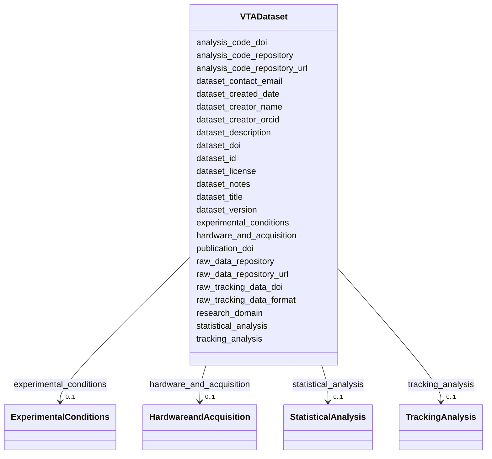

---
search:
  boost: 10.0
---

# Class: VTADataset 


_Top-level study and provenance metadata for a VTA dataset. One record per publication or deposited dataset. Contains identifying, licensing, and bibliographic information._


<div data-search-exclude markdown="1">


URI: [BeStMeta:VTADataset](https://w3id.org/BeStMeta/VTADataset)





<!-- no inheritance hierarchy -->

## Class Properties

| Property | Value |
| --- | --- |
| Tree Root | Yes |


## Slots

| Name | Cardinality and Range | Description | Inheritance |
| ---  | --- | --- | --- |
| [dataset_id](dataset_id.md) | 1 <br/> [String](String.md) | Unique identifier for the dataset or study package | direct |
| [dataset_title](dataset_title.md) | 1 <br/> [String](String.md) | Descriptive title of the dataset | direct |
| [dataset_license](dataset_license.md) | 1 <br/> [String](String.md) | SPDX license identifier or URL (e | direct |
| [dataset_description](dataset_description.md) | 0..1 _recommended_ <br/> [String](String.md) | Free-text description of the dataset and its scientific purpose | direct |
| [dataset_doi](dataset_doi.md) | 0..1 _recommended_ <br/> [Uri](Uri.md) | DOI of the deposited dataset (assigned by repository) | direct |
| [publication_doi](publication_doi.md) | 0..1 _recommended_ <br/> [Uri](Uri.md) | DOI of the publication associated with the dataset | direct |
| [dataset_creator_name](dataset_creator_name.md) | * _recommended_ <br/> [String](String.md) | Name(s) of data creators | direct |
| [dataset_creator_orcid](dataset_creator_orcid.md) | * _recommended_ <br/> [Uri](Uri.md) | ORCID identifier of the dataset creator | direct |
| [dataset_contact_email](dataset_contact_email.md) | 0..1 _recommended_ <br/> [String](String.md) | Contact email for the dataset maintainer | direct |
| [research_domain](research_domain.md) | 0..1 _recommended_ <br/> [String](String.md) | Primary research domain of this study | direct |
| [raw_data_repository](raw_data_repository.md) | 0..1 _recommended_ <br/> [String](String.md) | Repository where raw tracking data and/or video files are deposited | direct |
| [raw_data_repository_url](raw_data_repository_url.md) | 0..1 _recommended_ <br/> [Uri](Uri.md) | URL of the repository record or landing page | direct |
| [raw_tracking_data_format](raw_tracking_data_format.md) | * _recommended_ <br/> [String](String.md) | File format of the raw tracking data | direct |
| [dataset_version](dataset_version.md) | 0..1 <br/> [String](String.md) | Semantic version string for the dataset (e | direct |
| [dataset_created_date](dataset_created_date.md) | 0..1 <br/> [Date](Date.md) | Date when the dataset was created (YYYY-MM-DD) | direct |
| [raw_tracking_data_doi](raw_tracking_data_doi.md) | 0..1 <br/> [Uri](Uri.md) | DOI of the deposited raw tracking data | direct |
| [analysis_code_repository](analysis_code_repository.md) | 0..1 <br/> [String](String.md) | Repository where analysis code is hosted | direct |
| [analysis_code_repository_url](analysis_code_repository_url.md) | 0..1 <br/> [Uri](Uri.md) | URL of the code repository | direct |
| [analysis_code_doi](analysis_code_doi.md) | 0..1 <br/> [Uri](Uri.md) | DOI of the deposited analysis code | direct |
| [dataset_notes](dataset_notes.md) | 0..1 <br/> [String](String.md) | Free-text notes on the dataset not captured by structured fields | direct |
| [experimental_conditions](experimental_conditions.md) | 0..1 <br/> [ExperimentalConditions](ExperimentalConditions.md) | Biological and experimental conditions for this dataset | direct |
| [hardware_and_acquisition](hardware_and_acquisition.md) | 0..1 <br/> [HardwareandAcquisition](HardwareandAcquisition.md) | Hardware and acquisition configuration used to record the video dataset | direct |
| [tracking_analysis](tracking_analysis.md) | 0..1 <br/> [TrackingAnalysis](TrackingAnalysis.md) | Tracking software and analysis configuration | direct |
| [statistical_analysis](statistical_analysis.md) | 0..1 <br/> [StatisticalAnalysis](StatisticalAnalysis.md) | Statistical analysis for this dataset | direct |


## Identifier and Mapping Information


### Schema Source


* from schema: https://w3id.org/bestmeta/schema


## Mappings

| Mapping Type | Mapped Value |
| ---  | ---  |
| self | BeStMeta:VTADataset |
| native | BeStMeta:VTADataset |


## LinkML Source

<!-- TODO: investigate https://stackoverflow.com/questions/37606292/how-to-create-tabbed-code-blocks-in-mkdocs-or-sphinx -->

### Direct

<details>
```yaml
name: VTADataset
description: Top-level study and provenance metadata for a VTA dataset. One record
  per publication or deposited dataset. Contains identifying, licensing, and bibliographic
  information.
from_schema: https://w3id.org/bestmeta/schema
slots:
- dataset_id
- dataset_title
- dataset_license
- dataset_description
- dataset_doi
- publication_doi
- dataset_creator_name
- dataset_creator_orcid
- dataset_contact_email
- research_domain
- raw_data_repository
- raw_data_repository_url
- raw_tracking_data_format
- dataset_version
- dataset_created_date
- raw_tracking_data_doi
- analysis_code_repository
- analysis_code_repository_url
- analysis_code_doi
- dataset_notes
- experimental_conditions
- hardware_and_acquisition
- tracking_analysis
- statistical_analysis
tree_root: true

```
</details>

### Induced

<details>
```yaml
name: VTADataset
description: Top-level study and provenance metadata for a VTA dataset. One record
  per publication or deposited dataset. Contains identifying, licensing, and bibliographic
  information.
from_schema: https://w3id.org/bestmeta/schema
attributes:
  dataset_id:
    name: dataset_id
    description: Unique identifier for the dataset or study package.
    from_schema: https://w3id.org/bestmeta/schema
    exact_mappings:
    - dcterms:identifier
    rank: 1000
    identifier: true
    owner: VTADataset
    domain_of:
    - VTADataset
    range: string
    required: true
  dataset_title:
    name: dataset_title
    description: Descriptive title of the dataset.
    from_schema: https://w3id.org/bestmeta/schema
    exact_mappings:
    - dcterms:title
    rank: 1000
    owner: VTADataset
    domain_of:
    - VTADataset
    range: string
    required: true
  dataset_license:
    name: dataset_license
    description: SPDX license identifier or URL (e.g. CC-BY-4.0)
    from_schema: https://w3id.org/bestmeta/schema
    exact_mappings:
    - dcterms:license
    rank: 1000
    owner: VTADataset
    domain_of:
    - VTADataset
    range: string
    required: true
  dataset_description:
    name: dataset_description
    description: Free-text description of the dataset and its scientific purpose
    from_schema: https://w3id.org/bestmeta/schema
    exact_mappings:
    - dcterms:description
    rank: 1000
    owner: VTADataset
    domain_of:
    - VTADataset
    range: string
    required: false
    recommended: true
  dataset_doi:
    name: dataset_doi
    description: DOI of the deposited dataset (assigned by repository)
    from_schema: https://w3id.org/bestmeta/schema
    exact_mappings:
    - schema:identifier
    close_mappings:
    - dcterms:identifier
    rank: 1000
    owner: VTADataset
    domain_of:
    - VTADataset
    range: uri
    required: false
    recommended: true
    multivalued: false
    pattern: ^https://doi\.org/10\.\d{4,9}/[-._;()+/:A-Za-z0-9%]+$
  publication_doi:
    name: publication_doi
    description: DOI of the publication associated with the dataset.
    from_schema: https://w3id.org/bestmeta/schema
    exact_mappings:
    - schema:citation
    - dcterms:references
    rank: 1000
    owner: VTADataset
    domain_of:
    - VTADataset
    range: uri
    required: false
    recommended: true
    pattern: ^https://doi\.org/10\.\d{4,9}/[-._;()+/:A-Za-z0-9%]+$
  dataset_creator_name:
    name: dataset_creator_name
    description: Name(s) of data creators.
    from_schema: https://w3id.org/bestmeta/schema
    exact_mappings:
    - dcterms:creator
    - schema:creator
    rank: 1000
    owner: VTADataset
    domain_of:
    - VTADataset
    range: string
    required: false
    recommended: true
    multivalued: true
  dataset_creator_orcid:
    name: dataset_creator_orcid
    description: ORCID identifier of the dataset creator.
    from_schema: https://w3id.org/bestmeta/schema
    exact_mappings:
    - schema:identifier
    - dcterms:identifier
    rank: 1000
    owner: VTADataset
    domain_of:
    - VTADataset
    range: uri
    required: false
    recommended: true
    multivalued: true
    pattern: ^https://orcid\.org/\d{4}-\d{4}-\d{4}-\d{3}[0-9X]$
  dataset_contact_email:
    name: dataset_contact_email
    description: Contact email for the dataset maintainer.
    from_schema: https://w3id.org/bestmeta/schema
    exact_mappings:
    - schema:email
    rank: 1000
    owner: VTADataset
    domain_of:
    - VTADataset
    range: string
    required: false
    recommended: true
    pattern: ^[A-Za-z0-9._%+-]+@[A-Za-z0-9.-]+\.[A-Za-z]{2,}$
  research_domain:
    name: research_domain
    description: Primary research domain of this study.
    from_schema: https://w3id.org/bestmeta/schema
    exact_mappings:
    - dcterms:subject
    rank: 1000
    owner: VTADataset
    domain_of:
    - VTADataset
    range: string
    required: false
    recommended: true
  raw_data_repository:
    name: raw_data_repository
    description: Repository where raw tracking data and/or video files are deposited.
    from_schema: https://w3id.org/bestmeta/schema
    rank: 1000
    owner: VTADataset
    domain_of:
    - VTADataset
    range: string
    required: false
    recommended: true
  raw_data_repository_url:
    name: raw_data_repository_url
    description: URL of the repository record or landing page.
    from_schema: https://w3id.org/bestmeta/schema
    exact_mappings:
    - schema:url
    - dcterms:source
    rank: 1000
    owner: VTADataset
    domain_of:
    - VTADataset
    range: uri
    required: false
    recommended: true
  raw_tracking_data_format:
    name: raw_tracking_data_format
    description: File format of the raw tracking data.
    from_schema: https://w3id.org/bestmeta/schema
    rank: 1000
    owner: VTADataset
    domain_of:
    - VTADataset
    range: string
    required: false
    recommended: true
    multivalued: true
  dataset_version:
    name: dataset_version
    description: Semantic version string for the dataset (e.g. 1.0.0)
    from_schema: https://w3id.org/bestmeta/schema
    exact_mappings:
    - pav:version
    - schema:version
    rank: 1000
    owner: VTADataset
    domain_of:
    - VTADataset
    range: string
    required: false
    pattern: ^[0-9]+\.[0-9]+\.[0-9]+$
  dataset_created_date:
    name: dataset_created_date
    description: Date when the dataset was created (YYYY-MM-DD)
    from_schema: https://w3id.org/bestmeta/schema
    exact_mappings:
    - dcterms:created
    rank: 1000
    owner: VTADataset
    domain_of:
    - VTADataset
    range: date
    required: false
  raw_tracking_data_doi:
    name: raw_tracking_data_doi
    description: DOI of the deposited raw tracking data
    from_schema: https://w3id.org/bestmeta/schema
    exact_mappings:
    - schema:identifier
    close_mappings:
    - dcterms:identifier
    rank: 1000
    owner: VTADataset
    domain_of:
    - VTADataset
    range: uri
    required: false
    pattern: ^https://doi\.org/10\.\d{4,9}/[-._;()+/:A-Za-z0-9%]+$
  analysis_code_repository:
    name: analysis_code_repository
    description: Repository where analysis code is hosted.
    from_schema: https://w3id.org/bestmeta/schema
    rank: 1000
    owner: VTADataset
    domain_of:
    - VTADataset
    range: string
    required: false
  analysis_code_repository_url:
    name: analysis_code_repository_url
    description: URL of the code repository.
    from_schema: https://w3id.org/bestmeta/schema
    exact_mappings:
    - schema:codeRepository
    - schema:url
    rank: 1000
    owner: VTADataset
    domain_of:
    - VTADataset
    range: uri
    required: false
  analysis_code_doi:
    name: analysis_code_doi
    description: DOI of the deposited analysis code.
    from_schema: https://w3id.org/bestmeta/schema
    rank: 1000
    owner: VTADataset
    domain_of:
    - VTADataset
    range: uri
    required: false
    pattern: ^https://doi\.org/10\.\d{4,9}/[-._;()+/:A-Za-z0-9%]+$
  dataset_notes:
    name: dataset_notes
    description: Free-text notes on the dataset not captured by structured fields.
    from_schema: https://w3id.org/bestmeta/schema
    rank: 1000
    owner: VTADataset
    domain_of:
    - VTADataset
    range: string
    required: false
  experimental_conditions:
    name: experimental_conditions
    description: Biological and experimental conditions for this dataset
    from_schema: https://w3id.org/bestmeta/schema
    rank: 1000
    owner: VTADataset
    domain_of:
    - VTADataset
    range: ExperimentalConditions
    inlined: true
  hardware_and_acquisition:
    name: hardware_and_acquisition
    description: Hardware and acquisition configuration used to record the video dataset.
    from_schema: https://w3id.org/bestmeta/schema
    rank: 1000
    owner: VTADataset
    domain_of:
    - VTADataset
    range: HardwareandAcquisition
    inlined: true
  tracking_analysis:
    name: tracking_analysis
    description: Tracking software and analysis configuration
    from_schema: https://w3id.org/bestmeta/schema
    rank: 1000
    owner: VTADataset
    domain_of:
    - VTADataset
    range: TrackingAnalysis
    inlined: true
  statistical_analysis:
    name: statistical_analysis
    description: Statistical analysis for this dataset
    from_schema: https://w3id.org/bestmeta/schema
    rank: 1000
    owner: VTADataset
    domain_of:
    - VTADataset
    range: StatisticalAnalysis
    inlined: true
tree_root: true

```
</details></div>